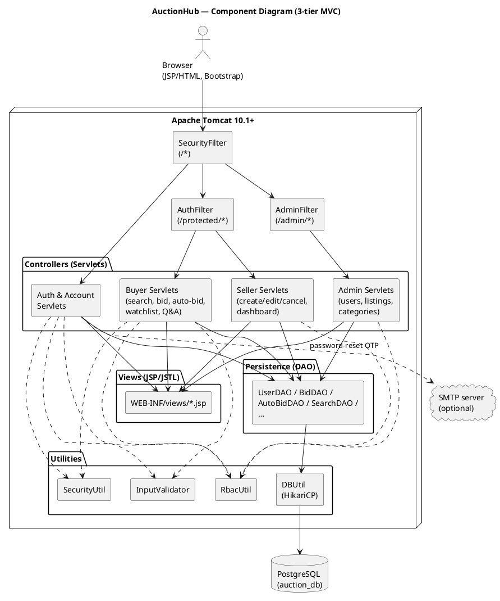
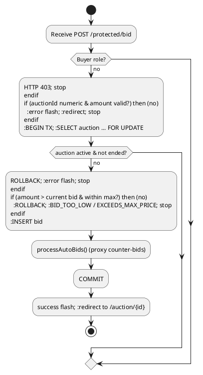
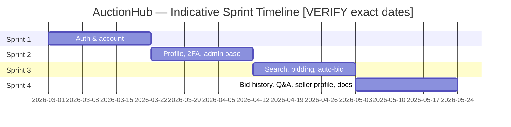

# Preliminary Technical Document

| | |
|---|---|
| **Document title** | Preliminary Technical Document |
| **Project name** | Online Auction Platform (AuctionHub) |
| **Repository** | FYP-26-S2-24 |
| **Document version** | 1.0 (Preliminary) |
| **Date** | June 2026 |
| **Team** | [VERIFY: team name] |
| **Team members & roles** | [VERIFY: roster — name, role] |

> **Scope note.** This document covers system architecture, design, testing and project management for the AuctionHub platform. The functional and non-functional **requirements specification is maintained separately** and is *not* reproduced here; this document references requirement / user-story identifiers (SCRUM-xx) for traceability only.

---

## Table of Contents

1. [Critical Requirement Deltas Since Last Submission](#1-critical-requirement-deltas-since-last-submission)
2. [System Architecture](#2-system-architecture)
3. [System Design](#3-system-design)
4. [System Testing](#4-system-testing)
5. [Project Management](#5-project-management)
6. [References](#6-references)
7. [Appendices](#7-appendices)

---

## 1. Critical Requirement Deltas Since Last Submission

> **Baseline note.** The exact date and contents of the previous submission baseline are **[VERIFY: date of last submission]**. The table below lists the **confirmed feature increments** that are present in the current codebase and version control, grouped by development sprint, so that assessors can identify what changed. If a formal prior baseline exists, deltas should be read relative to it.

### 1.1 Confirmed increments (delta table)

| Change ID | Area | Description | Impact | Status |
|-----------|------|-------------|--------|--------|
| SCRUM-21 | Admin | User **unban** action with pre-condition validation and audit logging | Adds reversible moderation; complements existing ban | Implemented + unit-tested |
| SCRUM-23 | Admin | **Category CRUD** (create/edit/soft-delete/restore) with slug + restrict-delete | New admin-managed taxonomy | Implemented + unit-tested |
| SCRUM-48 | Buyer | Public **keyword search** with pagination | Core discovery feature | Implemented + unit-tested |
| SCRUM-51 | Buyer | **Place bid** with transactional, row-locked persistence | Core auction function | Implemented + unit-tested |
| SCRUM-52 | Buyer | **Auto-bid / proxy bidding** with encrypted max amount + note | Competitive bidding automation | Implemented + unit-tested |
| SCRUM-58 | Buyer | Public **bid history** with masked usernames + pagination | Transparency before bidding | Implemented + unit-tested |
| SCRUM-59 | Buyer | **Multi-filter search** (price, condition, location, end window) | Refined discovery | Implemented + unit-tested |
| SCRUM-60 | Buyer | **Search sort** (newest, ending soon, price asc/desc) via whitelist | Refined discovery | Implemented + unit-tested |
| SCRUM-62 | Buyer/Seller | **Auction Q&A** (buyer asks, seller replies, ownership-checked) | Pre-sale communication | Implemented + unit-tested |
| SCRUM-63 | Public | Public **seller profile** with masked email + ratings | Trust / reputation | Implemented + unit-tested |
| (supporting) | Buyer | Watchlist, bidding history, rate seller, report seller | Engagement features | Implemented + unit-tested |
| (supporting) | Seller | Create / edit / cancel auction, seller dashboard, rate buyer | Seller lifecycle | Implemented; some views pending (see §3.8) |

### 1.2 Known design deltas affecting documentation

- **Search DAO signature evolved** from a 4-argument call to a 6-argument call `search(keyword, categoryName, SearchFilter, SearchSort, page, pageSize)` to accommodate SCRUM-59/60. Older unit-test mocks were migrated accordingly.
- **Username masking** was extended with `SecurityUtil.maskUsernameFully(...)` for non-leading bidders in public bid history (SCRUM-58).
- **Operational delta:** Tomcat may require an increased `maxHttpHeaderSize` when a development browser accumulates large cookies on `localhost`; otherwise requests fail with HTTP 400 *"Request header is too large"* (see §4.6 and the User Manual).

---

## 2. System Architecture

### 2.1 Three-tier client–server architecture

AuctionHub is a server-rendered Java web application deployed as a single WAR (`online-auction.war`) on Apache Tomcat. It follows a classic **three-tier** decomposition:

| Tier | Responsibility | Technology in this project |
|------|----------------|----------------------------|
| **Presentation (client)** | Renders HTML, collects user input, light client-side validation/countdown | Web browser; JSP + JSTL server-side templates; Bootstrap 5.3.3 and bootstrap-icons 1.11.3 (jsDelivr CDN); small page-specific JS |
| **Application (server)** | Request routing, authentication/authorisation, business logic, orchestration | Jakarta Servlets + Filters running in Tomcat 10.1+ (Servlet 6.x); `com.auction.servlet`, `com.auction.filter`, `com.auction.util` |
| **Data** | Persistent storage, relational integrity, transactions | PostgreSQL accessed via JDBC; connection pooling by HikariCP (`DBUtil`); DAO layer in `com.auction.dao` |

```
   ┌─────────────┐   HTTPS/HTTP    ┌──────────────────────────────┐   JDBC    ┌──────────────┐
   │   Browser   │ ───────────────▶│  Tomcat 10.1+ (Servlet cont.)│ ─────────▶│  PostgreSQL  │
   │ (JSP/HTML)  │ ◀─────────────── │  Filters → Servlets → DAOs   │ ◀───────── │  auction_db  │
   └─────────────┘   HTML response  └──────────────────────────────┘  ResultSet └──────────────┘
                                      ▲ HikariCP pool (DBUtil)
```

The platform does **not** use any machine-learning or neural-network component; that architectural style is **Not Applicable** to this project. The system is deliberately a conventional transactional web application.

### 2.2 MVC mapping

Within the application tier, the project applies the **Model–View–Controller** pattern, augmented by a dedicated **DAO** persistence layer and cross-cutting **Filters**:

| MVC role | Java package / location | Examples |
|----------|-------------------------|----------|
| **Controller** | `com.auction.servlet` (+ `.admin`, `.seller`) | `LoginServlet`, `PlaceBidServlet`, `SearchServlet`, `AdminCategoriesServlet` |
| **Model (domain)** | `com.auction.model` (+ `.admin`, `.seller`, `.profile`) | `User`, `Auction`, `AuctionDetail`, `Bid`, enums `Role`/`Status`/`SearchSort` |
| **Persistence (DAO)** | `com.auction.dao` | `UserDAO`, `BidDAO`, `AutoBidDAO`, `SearchDAO` |
| **View** | `src/main/webapp/WEB-INF/views/*.jsp` | `auction-detail.jsp`, `search.jsp`, `admin/dashboard.jsp` |
| **Cross-cutting** | `com.auction.filter` | `SecurityFilter`, `AuthFilter`, `AdminFilter` |
| **Utilities** | `com.auction.util` | `SecurityUtil`, `InputValidator`, `RbacUtil`, `DBUtil`, `TotpUtil`, `OtpStore`, `MailConfig` |

A typical request flows: **Browser → Filter chain → Servlet (controller) → DAO → PostgreSQL → DAO → Servlet → JSP (view) → Browser.** Servlets never embed SQL; all data access is delegated to DAOs that use `PreparedStatement`.

### 2.3 Request routing and access tiers

Routing is declared with `@WebServlet` / `@WebFilter` annotations (component scanning); `WEB-INF/web.xml` contains only an `uploadDir` context parameter. There are three access tiers enforced by URL prefix:

| URL space | Filter | Access policy |
|-----------|--------|---------------|
| Public (e.g. `/`, `/search`, `/auction/*`, `/auction-bids`, `/seller/*`, `/login`, `/register`) | `SecurityFilter` only | No authentication required |
| `/protected/*` | `SecurityFilter` + `AuthFilter` | Authenticated session required; otherwise redirect to `/login` |
| `/admin`, `/admin/*` | `SecurityFilter` + `AdminFilter` | Authenticated **and** `Role.ADMIN`; non-admins receive HTTP 403 |

`SecurityFilter` (`/*`) sets security response headers on **every** request: `X-Content-Type-Options: nosniff`, `X-Frame-Options: DENY`, `X-XSS-Protection: 1; mode=block`, and a Content-Security-Policy permitting `self` plus `cdn.jsdelivr.net` for styles/scripts/fonts.

### 2.4 UML component diagram

The following PlantUML component diagram summarises the deployable components and their dependencies. (Render with PlantUML; the project's authoritative class-level model is `docs/class-diagrams/SCRUM-297-mvc-master-class-diagram.puml`.)



### 2.5 Why MVC + DAO (design rationale)

- **Separation of concerns:** Controllers handle HTTP and orchestration; DAOs isolate SQL; JSPs handle presentation. This makes servlets unit-testable with mocked DAOs (see §4).
- **Testability:** Every servlet exposes a DAO-injection constructor, enabling Mockito-based unit tests without a live database.
- **Security containment:** All SQL is parameterised inside DAOs; masking/encryption is centralised in `SecurityUtil`; RBAC is centralised in `RbacUtil` and the filter layer.
- **No ML/neural-net architecture** is used — the domain (auctions, bids, moderation) is transactional and rule-based, so a relational + MVC design is the appropriate, lower-risk choice.

---

## 3. System Design

### 3.1 Database schema and ERD

The authoritative schema is `FYP/src/main/resources/auction_db.sql`, extended by migration scripts under `FYP/src/main/resources/db/`. The ERD is maintained as `docs/database/SCRUM-297-postgresql-erd.puml`.

**Core entities** (selected columns):

| Table | Key columns | Purpose |
|-------|-------------|---------|
| `users` | `id` PK; `email` UQ; `username` UQ; `password`; `role_id` FK→`roles`; `status_id` FK→`user_status`; `two_factor_secret`; `phone_encrypted`; `address_encrypted` | Accounts; encrypted PII at rest |
| `auction` | `auction_id` PK; `seller_id` FK→`users`; `status_id` FK→`auction_status`; `auction_type` FK→`auction_type`; `date_end`; `report_count`; `moderation_state` CHECK(active/flagged/removed) | Auction header + moderation state |
| `auction_details` | `id` PK/FK→`auction` (1:1); `title`; `description`; `category`; `item_condition_id` FK→`item_status`; `starting_price`; `max_price`; `winning_bid`; `winner_id` | Auction body + pricing |
| `auction_images` | `id` PK; `auction_id` FK | 1:N images |
| `auction_tag_info` | (`auction_id`,`tag_id`) composite PK/FK | M:N auctions↔`tags` |
| `bids` | `bid_id` PK; `auction_id` FK; `user_id` FK; `bid_amount` NUMERIC(10,2) CHECK≥0; `bid_time` | Bid ledger |
| `auto_bids` | `id` PK; (`auction_id`,`user_id`) UQ; `max_amount_enc`; `note_enc` | Encrypted proxy-bid ceilings |
| `auction_questions` | `id` PK; `auction_id` FK; `asker_user_id` FK; `question_text`; `answer_text`; `answered_at` | Q&A threads |
| `categories` | `id` PK; `name` UQ; `slug` UQ; `is_deleted` | Admin taxonomy (soft-delete) |
| `user_reviews` | `id` PK; `reviewer_user_id` FK; `reviewee_user_id` FK; `auction_id` FK; `rating` CHECK 1–5; UQ(`auction_id`,`reviewer_user_id`) | Bi-directional ratings |
| `watchlist` | `id` PK; (`user_id`,`auction_id`) UQ | Saved auctions |
| `seller_reports` / `account_reports` | report rows; UQ per reporter pair | Abuse reporting |

**Lookup/reference tables (seeded):** `roles` (Admin/Buyer/Seller), `user_status` (Active/Suspended/Deleted), `categories` (7 rows via migration). `auction_status`, `auction_type`, `item_status` are referenced by ID and **[VERIFY: seed rows for these lookup tables are not in the SQL files — confirm they are inserted manually or by the application]**.

**Indexes (non-PK):** `idx_auction_details_title` (LOWER(title)), `idx_auction_moderation_end` (`moderation_state`,`date_end`), `idx_auto_bids_auction`, `idx_auction_questions_auction`.

**Migration scripts** (`db/`): `migration_admin_moderation.sql`, `migration_auction_questions.sql`, `migration_auto_bids.sql`, `migration_categories.sql`, `migration_search_index.sql`, `migration_seller_features.sql`, `migration_seller_ratings.sql`, `migration_seller_reports.sql`, `migration_user_reviews.sql`, `migration_watchlist.sql`.

> **Design note.** `auction_details.category` is a free-text string and is **not** a foreign key to `categories`; the normalised `categories` table is used by the admin taxonomy and matched by name/slug by convention.

### 3.2 UML class diagram

The MVC master class diagram is `docs/class-diagrams/SCRUM-297-mvc-master-class-diagram.puml` (v1.1). It groups types into Model, DAO, Controller (Servlet/Filter), View and Util layers. Key relationships:

- Servlets depend on one or more DAOs (constructor-injected) and on `SecurityUtil` / `RbacUtil` / `InputValidator`.
- DAOs depend on `DBUtil` for pooled connections and return Model objects / projection rows.
- Enums (`Role`, `Status`, `AuctionStatus`, `ItemCondition`, `SearchSort`) encode controlled vocabularies and map to lookup tables or fixed IDs.

### 3.3 Sequence diagrams

Feature flows are documented as PlantUML under `docs/sequence-diagrams/`:

| Feature | Diagram file | Flow summary |
|---------|--------------|--------------|
| Logout | `SCRUM-7-logout-sequence.puml` | Invalidate session → redirect `/login`; post-logout `/protected/*` blocked |
| Account management | `SCRUM-8-account-management.puml` | Load dashboard with decrypted PII for owner |
| Account deletion | `SCRUM-9-account-deletion.puml` | Confirm → anonymise PII → set DELETED → invalidate session |
| Profile update | `SCRUM-11-profile-update.puml` | Validate → encrypt PII → persist |
| Change password | `SCRUM-12-change-password.puml` | Verify current → hash new → invalidate session |
| Admin unban | `SCRUM-21-unban-sequence.puml` | Validate state → transactional status update → audit log |
| Category CRUD | `SCRUM-23-category-crud-sequence.puml` | Create/edit/soft-delete/restore with duplicate + restrict-delete checks |
| Search | `SCRUM-48-search-sequence.puml` | Validate query → `SearchDAO.search/count` → results page |
| Bidding | `SCRUM-51-bidding-sequence.puml` | Lock auction row (FOR UPDATE) → validate → insert bid → process auto-bids |
| Auto-bid | `SCRUM-52-auto-bid-sequence.puml` | Encrypt ceiling → proxy-bid resolution loop |
| Bid history | `SCRUM-58-auction-bid-history-sequence.puml` | Determine leader → mask usernames → paginate |
| Search filter | `SCRUM-59-search-filter-sequence.puml` | Parse + validate filters → bound params to DAO |
| Search sort | `SCRUM-60-search-sort-sequence.puml` | Whitelist `sortBy` → fixed ORDER BY fragment |
| Auction Q&A | `SCRUM-62-auction-question-sequence.puml` | Buyer ask / seller reply with ownership checks |
| Seller profile | `SCRUM-63-seller-profile-sequence.puml` | Active-seller lookup → masked email → paginated reviews |

### 3.4 Use case descriptions

Representative use cases (actors, pre/post-conditions, flows). These describe behaviour, not requirements.

**UC-01 Place Bid**
- **Actor:** Buyer (authenticated, not the seller)
- **Preconditions:** Auction exists, is `active` moderation state, not ended; user has Buyer role.
- **Main flow:** Buyer enters amount on auction detail → confirms in modal → `POST /protected/bid` → `BidDAO.placeBid` locks the auction row, validates floor/max/self-bid, inserts bid, runs auto-bid resolution → redirect back with success flash.
- **Postconditions:** New row in `bids`; current bid updated; any triggered proxy counter-bids inserted.
- **Exceptions:** `BID_TOO_LOW`, `EXCEEDS_MAX_PRICE`, `AUCTION_CLOSED`, `AUCTION_REMOVED`, `SELF_BID`, `AUCTION_NOT_FOUND` → error flash.

**UC-02 Set Auto-Bid**
- **Actor:** Buyer. **Preconditions:** Open auction, not own auction, max > current bid.
- **Main flow:** `POST /protected/auto-bid` (action=SET) → `AutoBidDAO.upsert` encrypts max amount and optional note → success flash. action=CANCEL deletes the row.
- **Postconditions:** Encrypted ceiling stored (unique per auction+user).
- **Exceptions:** ended/cancelled auction, max ≤ current bid, seller on own auction → error flash.

**UC-03 Search Auctions**
- **Actor:** Public visitor. **Preconditions:** none.
- **Main flow:** `GET /search?q=…` (+ optional category, filters, sortBy, page) → query validated/sanitised → `SearchDAO.search`/`count` (only active, non-expired auctions) → results page with pagination.
- **Exceptions:** Blank query redirects home; invalid filters silently dropped.

**UC-04 View Bid History**
- **Actor:** Public visitor. **Preconditions:** auction exists.
- **Main flow:** `GET /auction-bids?auctionId=…&page=&size=` → existence check → leader determined → usernames masked (leader partial, others full) → paginated table.
- **Exceptions:** missing/invalid `auctionId` → 400; unknown auction → 404; no bids → empty state.

**UC-05 Ask / Answer Question**
- **Actors:** Buyer (ask), Seller (reply). **Preconditions:** open auction; seller owns auction to reply.
- **Main flow:** `POST /protected/auction-question` (ASK or REPLY) → validate + sanitise text → `QuestionDAO.insertQuestion`/`insertReply` (ownership + state checks) → redirect to `/auction/{id}#questions`.
- **Exceptions:** `SELF_QUESTION`, `AUCTION_CLOSED`, `NOT_SELLER`, `ALREADY_ANSWERED`.

**UC-06 Admin Ban / Unban User**
- **Actor:** Admin. **Preconditions:** target is a non-admin, non-self account.
- **Main flow:** `POST /admin/users/action` (suspend / active|unban) → state pre-condition validated → status updated → audit log + flash.
- **Exceptions:** already-banned, already-active, deleted account, admin target, self-action → error.

**UC-07 Admin Manage Categories**
- **Actor:** Admin.
- **Main flow:** `POST /admin/categories` (CREATE/EDIT/DELETE/RESTORE) → name/slug duplicate checks; delete is restricted if auctions reference the category → soft-delete toggles `is_deleted`.

**UC-08 Register / Login / Logout**
- **Actor:** Visitor / user.
- **Main flow:** Register validates fields, hashes password, inserts user. Login verifies password, sets session attributes (incl. masked email/username), redirects by role. Logout invalidates the session.
- **Exceptions:** duplicate email/username, weak password, suspended/deleted account, invalid credentials.

**UC-09 Reset Password (OTP)**
- **Actor:** User. **Main flow:** `/forgot-password` generates a 6-digit OTP (5-min TTL) emailed via SMTP if configured, otherwise shown in-page (dev) → `/reset-password` verifies OTP and stores new salted hash.

**UC-10 Create / Edit / Cancel Auction**
- **Actor:** Seller. **Main flow:** create with images/tags (transactional); edit only while zero bids; cancel ACTIVE/PENDING auctions with reason.

**UC-11 Watchlist**
- **Actor:** Buyer. **Main flow:** add/remove auctions; cannot watch own auction; unique per user+auction.

**UC-12 Rate Seller / Buyer**
- **Actors:** Buyer rates seller; seller rates winning buyer after a finished auction; score 1–5; one review per auction per reviewer.

### 3.5 Activity diagrams (key flows)

**Place Bid (textual + PlantUML).**



**Auto-bid resolution (summary).** `AutoBidDAO.resolveNextAutoBid` is a pure function: given the current floor, the set of competing encrypted ceilings (decrypted), and the current top bidder, it determines whether a counter-bid fires and at what amount (floor + 0.01, leapfrogging competitors, capped at the winner's ceiling, FIFO tie-break by `created_at`). The loop runs up to 50 rounds within the same transaction as `placeBid`.

**Search with filters (summary).** Parse `q` (validated, max 200 chars) → parse optional category slug (resolved to name) → parse filters (invalid values silently dropped) → resolve `sortBy` against the `SearchSort` whitelist → call `SearchDAO.search/count` with bound parameters → forward to `search.jsp`.

### 3.6 Functional hierarchy

```
AuctionHub
├── Authentication & Account
│   ├── Register / Login / Logout
│   ├── Forgot / Reset password (OTP)
│   ├── Two-factor (TOTP)         [VERIFY: TwoFactorServlet present but not URL-mapped]
│   ├── View / Edit profile, Change password
│   └── Delete account (PDPA anonymisation)
├── Buyer
│   ├── Search (keyword / category / filters / sort)
│   ├── Auction detail, Bid history (public)
│   ├── Place bid, Auto-bid
│   ├── Watchlist, Bidding history
│   ├── Ask question, Rate seller, Report seller
│   └── Public seller profile
├── Seller
│   ├── Create / Edit / Cancel auction
│   ├── Seller dashboard
│   ├── Reply to questions
│   └── Rate buyer
└── Admin
    ├── Dashboard (metrics, activity)
    ├── User moderation (ban / unban)
    ├── Listing moderation (flag / remove / restore)
    ├── Category CRUD
    └── Analytics (placeholder)
```

### 3.7 Data flow (DFD)

**Context (Level 0).**

```
        ┌──────────────────────────────────────────┐
 Visitor│                                          │ Email (OTP)
 Buyer ─▶│            AuctionHub System             │──────────▶ SMTP server (optional)
 Seller │  (Tomcat web app + PostgreSQL database)   │
 Admin ─▶│                                          │
        └──────────────────────────────────────────┘
              ▲ requests            ▼ HTML pages
            users (browser)      rendered views
```

**Level 1 (selected processes).**

```
Buyer ──(bid request)──▶ [P1 Place Bid] ──(insert)──▶ {D: bids}
                              │ reads/locks ──▶ {D: auction, auction_details}
                              └─(process)──▶ [P2 Auto-bid] ──(counter-bids)──▶ {D: bids}

Visitor ─(query+filters)─▶ [P3 Search] ──(SELECT)──▶ {D: auction, auction_details, bids}
                                         └─(results)──▶ Visitor

Admin ──(moderate)──▶ [P4 User/Listing/Category Admin] ──▶ {D: users, auction, categories}
```

### 3.8 UX: sitemap, navigation and wireframes

**Sitemap (implemented routes → views).**

```
/                         → index.jsp (landing)
/search                   → search.jsp
/auction/{id}             → auction-detail.jsp
/auction-bids?auctionId=  → auction-bid-history.jsp
/seller/{id}              → seller-profile.jsp
/login /register
/forgot-password /reset-password   → auth/*.jsp
/protected/account        → account/dashboard.jsp
/protected/account/edit   → account/edit.jsp
/protected/account/password → account/change-password.jsp
/admin/dashboard|users|listings|categories|analytics → admin/*.jsp
/protected/seller/auctions     → [VERIFY: seller/auctions.jsp view not yet present]
/protected/bidding-history     → [VERIFY: bidding-history.jsp view not yet present]
/protected/watchlist           → [VERIFY: watchlist.jsp view not yet present]
/seller/edit-auction           → [VERIFY: seller/edit-auction.jsp view not yet present]
```

> **Implementation gap (honest disclosure).** Four servlets forward to JSP views that are **not yet present** in `webapp` (seller dashboard, edit-auction, bidding-history, watchlist). Their controllers and DAO methods are implemented and unit-tested, but the corresponding pages would currently fail to render. These are tracked as outstanding view work.

**Navigation structure.**
- `home-navbar.jsp` (public/sticky): brand, Explore, Sell Items, Help, search box (`GET /search`), sign-in/account, client-side category pills.
- `navbar.jsp` (account chrome): Home, My Account, Admin (admins only), masked username + Logout.
- `admin-sidebar.jspf`: Overview, User Moderation, Listing Moderation, Categories, Analytics, with active-state highlighting.

**Wireframe — Search results (`search.jsp`).**

```
┌───────────────────────────── home-navbar ─────────────────────────────┐
│ AuctionHub │ Explore  Sell  Help │  [ search q ............. 🔍 ] │ Sign in │
├───────────────────────────────────────────────────────────────────────┤
│ Results for "laptop"                                  12 listings found │
│ [active filter badges]                                  [Clear filters] │
│ ┌──────────────┐  ┌────────────────────────────────────────────────┐  │
│ │ FILTERS      │  │ Sort: [Newly listed ▾]                          │  │
│ │ Price min/max│  │ ┌─────────┐ ┌─────────┐ ┌─────────┐             │  │
│ │ Condition ▾  │  │ │ [img]   │ │ [img]   │ │ [img]   │   cards…     │  │
│ │ Location     │  │ │ title   │ │ title   │ │ title   │             │  │
│ │ Ending ▾     │  │ │ seller  │ │ seller  │ │ seller  │             │  │
│ │ [Apply][Reset]│  │ │ $bid View│ │ $bid View│ │ $bid View│            │  │
│ └──────────────┘  │ └─────────┘ └─────────┘ └─────────┘             │  │
│                   │ « Prev   1 2 3   Next »                          │  │
└───────────────────────────────────────────────────────────────────────┘
```

**Wireframe — Auction detail (`auction-detail.jsp`).**

```
┌───────────────────────────── home-navbar ─────────────────────────────┐
│ [bid success / error flash]                                            │
│ ┌───────────────────────────────┐ ┌──────────────────────────────────┐│
│ │  MAIN IMAGE (420px)            │ │ [category badge]                 ││
│ │  [thumb][thumb][thumb]         │ │ Title (h3)                       ││
│ │                                │ │ Sold by → seller profile link    ││
│ │  Description ……                │ │ ┌── BID CARD ──────────────────┐ ││
│ │                                │ │ │ Current bid  $1,250.00        │ ││
│ │                                │ │ │ Starting $… • N bids          │ ││
│ │                                │ │ │ Ends 2d 4h 11m                │ ││
│ │                                │ │ │ [ $ amount ] [ Place Bid ]    │ ││
│ │                                │ │ └───────────────────────────────┘ ││
│ │                                │ │ ▸ Set Maximum Auto-Bid (accordion)││
│ └───────────────────────────────┘ └──────────────────────────────────┘│
│ Bid History            [Full list →]                                   │
│  Bidder        | Amount    | Time          (leading row highlighted)   │
│  « Prev 1 2 Next »   Showing page 1 of 2                               │
│ Questions & Answers                                                    │
│  [asker] question…  → [seller reply]   |  [Ask a question] textarea    │
│ [MODAL] Confirm Your Bid — amount — [Cancel][Confirm Bid]              │
└───────────────────────────────────────────────────────────────────────┘
```

**Wireframe — Login (`auth/login.jsp`).**

```
┌──── auth-brand-header (AuctionHub) ────┐
│            Sign in your account         │
│   [Create Account]                      │
│   [ error alert (optional) ]            │
│   Email     [........................]  │
│   Password  [........................]  │
│   [        Login        ]               │
│   □ Remember me        Forgot password? │
└─────────────────────────────────────────┘
```

**Wireframe — Account dashboard (`account/dashboard.jsp`).**

```
┌── navbar (dark) ──────────────────────────────────────────────┐
│ User Profile                          [Profile] [Settings]     │
│ ┌── LEFT (4) ──────────┐ ┌── RIGHT (8) ───────────────────────┐│
│ │ avatar               │ │ [Transaction History | Reviews]    ││
│ │ username             │ │ Filter: [All ▾]                    ││
│ │ member since         │ │ ID | Date | Item | Type | Amt | St ││
│ │ masked email/phone   │ │ …                                  ││
│ │ [Edit profile]       │ │ Totals: purchases / sales / volume ││
│ │ Ratings ★★★★☆        │ │ ──────────────────────────────────  ││
│ │ Private info (full)  │ │ Danger zone [Delete my account]    ││
│ └──────────────────────┘ └────────────────────────────────────┘│
└────────────────────────────────────────────────────────────────┘
```

**Wireframe — Admin dashboard (`admin/dashboard.jsp`).**

```
┌── sidebar ──┬──────────────── main ──────────────────────────┐
│ Overview    │ Dashboard Overview                              │
│ Users       │ [Total Users] [Active Listings] [Flagged] [Rev]│
│ Listings    │ ┌ Users preview ─────┐ ┌ Listings preview ────┐│
│ Categories  │ │ User|Status|Role   │ │ Title|Reports|Status ││
│ Analytics   │ └────────────────────┘ └──────────────────────┘│
│ Account     │ Recent Activity: ● message …… time             │
│ Log out     │                                                 │
└─────────────┴─────────────────────────────────────────────────┘
```

**Wireframe — Seller public profile (`seller-profile.jsp`).**

```
┌── home-navbar ───────────────────────────────────────────────┐
│ ( avatar ) username  • masked email • member since   ★★★★☆ (N)│
│ Active listings: N                                            │
│ Review History                                                │
│  ★★★★★ [masked reviewer]            date                      │
│  Re: {auction title}                                          │
│  comment text …                                               │
│  « Prev 1 2 Next »                                            │
└───────────────────────────────────────────────────────────────┘
```

Styling: Bootstrap 5.3.3 + bootstrap-icons 1.11.3 (jsDelivr CDN) on all pages; local CSS under `webapp/css/` (`home.css`, `auth.css`, `profile.css`, `admin.css`); `auction-detail.jsp` uses inline styles.

---

## 4. System Testing

### 4.1 Test plan and schedule

Testing is integrated into each Agile sprint rather than deferred to a single phase:

| Phase | Activity | Stakeholders |
|-------|----------|--------------|
| Per user story | Write/extend JUnit unit tests alongside the servlet/DAO; run locally | Developer of the story |
| Per sprint | Run full `mvn test`; fix regressions before merge | Dev team |
| Pre-submission | Full suite + manual deployment smoke test on Tomcat | Dev team, [VERIFY: supervisor / tutor] |
| Ad-hoc | Manual UI walkthrough on Chrome/Edge after deploy | Dev team |

### 4.2 Test strategy

- **White-box unit testing (primary):** JUnit 5 + Mockito. Servlets are tested via a thin `Wrapper` subclass exposing `doGet`/`doPost`, with DAOs mocked. DAO algorithms with no I/O (e.g. `AutoBidDAO.resolveNextAutoBid`) are tested as pure functions.
- **Black-box manual testing:** UI walkthroughs against a deployed WAR to confirm navigation, flash messages and rendering.
- **Boundary Value Analysis (BVA) / Equivalence Partitioning (EP):** bid amounts (zero/negative/equal-to-current/over-max), score range 1–5, search query at/over 200 chars, pagination clamping, condition/sort whitelists.
- **Security-oriented tests:** RBAC matrices, IDOR guards (IDs from session not request), SQL-injection strings passed safely as bound parameters, masking/encryption assertions.

### 4.3 Test categories

| Category | Purpose | Example test classes | Status |
|----------|---------|----------------------|--------|
| User functional flows | Verify servlet behaviour per use case | `TestPlaceBidServlet`, `TestSearchServlet`, `TestWatchlistServlet`, `TestAuctionQuestionServlet` | Pass |
| Security / RBAC | Enforce role and session checks | `TestAdminFilter`, `TestLogoutServlet`, `TestSetAutoBidServlet` | Pass |
| Input validation / BVA | Reject malformed/boundary input | `TestSearchServletFilters`, `TestRateSellerServlet`, `InputValidatorProfileFieldsTest` | Pass |
| Database logic (DAO) | Verify SQL orchestration, transactions, rollback | `TestAuctionDAO`, `TestSellerAuctionDAO`, `TestUserDAO`, `UserDAODeleteAccountTest`, `UserDAOMappingTest` | Pass |
| Concurrency / bidding | Document/verify transactional bid + proxy algorithm | `TestPlaceBidServlet`, `TestSetAutoBidServlet` (`resolveNextAutoBid`) | Pass |
| Privacy (masking/encryption) | Verify PII masking and encryption | `TestAuctionBidHistory`, `TestSellerProfileServlet`, `TestUpdateProfileServlet`, `TestTwoFactorServlet` | Pass |

### 4.4 Concurrency and database accuracy testing

- **Pessimistic locking:** `BidDAO.placeBid` opens a transaction and executes `SELECT … FROM auction … FOR UPDATE`, serialising concurrent bids on the same auction; `AutoBidDAO.processAutoBids` runs on the same connection so proxy counter-bids are atomic with the originating bid. Unit tests assert the resulting `BidResult` outcomes; the locking guarantee is by design and verified at the algorithm/outcome level rather than by a live concurrency harness **[VERIFY: no automated multi-threaded load test exists]**.
- **Transaction rollback:** `TestAuctionDAO` asserts that a partial failure during `createAuction` rolls back the whole insert (auction + details + images + tags).
- **Mapping accuracy:** `UserDAOMappingTest` verifies `ResultSet → User` mapping including encrypted PII columns and optional password-hash inclusion.

### 4.5 Network-security / privacy testing

- **Encryption at rest:** PII (`phone_encrypted`, `address_encrypted`), 2FA secret, and auto-bid ceilings (`max_amount_enc`, `note_enc`) use AES-256-GCM via `SecurityUtil` (verified through servlet/DAO tests that encrypt-then-persist and decrypt-on-read).
- **Masking:** `SecurityUtil.maskEmail/maskUsername/maskUsernameFully/maskPhone` assertions in profile, bid-history and login tests.
- **Transport/headers:** `SecurityFilter` sets CSP and anti-clickjacking headers on all responses.
- **Note:** No formal penetration test / white-hat engagement has been performed; security verification is at the unit and design level **[VERIFY: confirm whether any external pen-test is in scope]**.

### 4.6 Results summary

- **Test classes:** 42 (100% JUnit 5; 40 use Mockito).
- **Latest full run:** all unit tests passing (≈606 individual test cases as last observed). Coverage percentage is **not** reported here to avoid fabricated metrics; a JaCoCo report can be added if required **[VERIFY: add JaCoCo if coverage % is mandatory]**.
- **Run command:**

```bash
cd FYP
mvn test
```

Subset example:

```bash
mvn test -Dtest=TestPlaceBidServlet,TestSetAutoBidServlet,TestAuctionBidHistory
```

### 4.7 Defects found and re-test

| Defect | Cause | Resolution | Re-test |
|--------|-------|------------|---------|
| Test compilation failures | Package-private constructors/methods accessed from default-package tests; a `static` field inside a `@Nested` class | Adjusted access modifiers; moved static helpers | Full `mvn test` green |
| `TestSearchServletCategory` failures | `SearchDAO.search` migrated from 4-arg to 6-arg (filters+sort, SCRUM-59/60) | Updated mocks/verifications to new signature | Targeted + full suite green |
| HTTP 400 "Request header is too large" on every action | Tomcat default `maxHttpHeaderSize` (8 KB) exceeded by accumulated browser cookies on `localhost` | Raised connector `maxHttpHeaderSize` to 64 KB; clear cookies (operational fix, server config) | Manual deploy verified |

### 4.8 Representative test cases

| ID | Category | Description | Input | Expected | Actual | SCRUM |
|----|----------|-------------|-------|----------|--------|-------|
| TC-01 | RBAC | Non-buyer cannot place bid | Seller session → POST /protected/bid | HTTP 403 | Pass | 266 |
| TC-02 | Functional | Valid bid succeeds | Buyer, valid amount | Success flash + redirect | Pass | 51 |
| TC-03 | BVA | Bid equal to current max rejected | amount == current bid | BID_TOO_LOW | Pass | 267 |
| TC-04 | BVA | Bid over max-price cap rejected | amount > max_price | EXCEEDS_MAX_PRICE | Pass | 267 |
| TC-05 | Security/IDOR | Non-numeric auctionId blocked | `' OR 1=1 --` | HTTP 400 | Pass | 295 |
| TC-06 | Algorithm | Higher ceiling wins, leapfrogs | two auto-bids | winner at optimal amount | Pass | 270 |
| TC-07 | Algorithm | Equal ceilings, FIFO wins | equal max, diff created_at | earlier wins | Pass | 270 |
| TC-08 | Validation | Negative price filter dropped | minPrice=-5 | filter null to DAO | Pass | 345 |
| TC-09 | Security | SQL injection in condition dropped | `'; DROP …` | filter dropped, no error | Pass | 345 |
| TC-10 | Security | sortBy whitelist | `sortBy='; DROP` | SearchSort.DEFAULT | Pass | 349 |
| TC-11 | Privacy | Leader partial vs others full mask | bid history rows | leader `l***r`, others `****` | Pass | 58/361 |
| TC-12 | Functional | Unknown auction bid history | auctionId=99999 | HTTP 404 | Pass | 362 |
| TC-13 | Pagination | Page beyond total clamped | page=99 | clamp + re-query | Pass | 361 |
| TC-14 | Admin | Ban already-banned user rejected | suspend on suspended | error flash | Pass | 212 |
| TC-15 | Admin | Cannot unban admin/self | action on admin/self | rejected | Pass | 279 |
| TC-16 | Auth | Suspended user cannot log in | suspended account | login blocked | Pass | — |
| TC-17 | Privacy | Login stores masked username | successful login | maskUsername in session | Pass | — |
| TC-18 | DAO/TX | createAuction rolls back on failure | partial insert error | full rollback | Pass | — |
| TC-19 | Privacy | Account deletion anonymises PII | delete account | DELETED + cleared PII | Pass | 9 |
| TC-20 | Q&A | Wrong seller reply rejected | seller B replies on A's auction | NOT_SELLER → 403 | Pass | 62 |

---

## 5. Project Management

### 5.1 Methodology and justification

The team adopted **Agile-Scrum**. Justification:

- **Iterative scope discovery:** an FYP brief evolves; sprint increments let the team deliver and demonstrate working features (auth → search → bidding → auto-bid → engagement) without a big-bang integration.
- **Jira-tracked stories with consistent subtask shape** — each user story is decomposed into: *(1) sequence diagram → (2) backend (DAO + servlet) → (3) security hardening → (4) unit tests*. This created a repeatable Definition of Done.
- **Continuous testing** kept the suite green between increments, reducing late-stage regression risk.

A Waterfall model was rejected because requirements and UI details were refined throughout, and early end-to-end demos were valuable for feedback.

### 5.2 Work Breakdown Structure (WBS)

| WBS | Work package | Representative outputs |
|-----|--------------|------------------------|
| 1 | Analysis | Requirements (separate doc), use-case identification |
| 2 | Design | ERD, MVC class diagram, per-feature sequence diagrams |
| 3 | Implementation | Servlets, DAOs, models, filters, JSP views, SQL + migrations |
| 4 | Testing | JUnit/Mockito unit tests, manual deployment testing |
| 5 | Documentation | README, technical document, user manual, diagrams |
| 6 | Deployment | WAR build, Tomcat deployment, environment configuration |

### 5.3 Roles and responsibilities

| Member | Role | Primary responsibilities |
|--------|------|--------------------------|
| [VERIFY] | Team leader / backend | [VERIFY: e.g. bidding, auto-bid, admin moderation, search] |
| [VERIFY] | [VERIFY] | [VERIFY] |
| [VERIFY] | [VERIFY] | [VERIFY] |
| [VERIFY] | [VERIFY] | [VERIFY] |

### 5.4 Timeline (Gantt)



> Dates above are **indicative placeholders [VERIFY: replace with actual sprint dates from Jira]**.

### 5.5 Development progress

- **Implemented & unit-tested:** authentication/account suite, admin moderation (users, listings, categories), search (keyword/category/filter/sort), bidding, auto-bid, bid history, Q&A, seller public profile, watchlist, ratings, reports.
- **Outstanding view work:** seller dashboard, edit-auction, bidding-history and watchlist JSP views are referenced by working controllers but not yet rendered (see §3.8).
- **Quantitative status:** 34 servlets URL-mapped and active; 15 DAOs; 42 test classes (~606 cases) passing. **[VERIFY: exact count of fully implemented *and* demoable use cases for the progress claim.]**

**Notable obstacles and workarounds:**

| Obstacle | Impact | Workaround / resolution |
|----------|--------|-------------------------|
| Test access-modifier mismatches | Build failures | Standardised on package-visible test hooks / DAO-injection constructors |
| Search API signature change (filters+sort) | Broken mocks | Migrated all affected tests to 6-arg signature |
| Tomcat HTTP 400 on large headers | App unusable during demo on shared `localhost` | Increased connector `maxHttpHeaderSize`; documented cookie-clearing |
| Lookup tables not seeded by SQL | Possible FK/empty dropdowns | **[VERIFY]** seed `auction_status`/`auction_type`/`item_status` before demo |

### 5.6 Risk register

| Risk | Likelihood | Impact | Mitigation |
|------|-----------|--------|------------|
| Missing seller/watchlist JSP views cause 500/404 in demo | Medium | Medium | Prioritise view completion or exclude those routes from the demo path |
| Un-seeded lookup tables break auction creation/search | Medium | High | Provide a seed script; verify on a clean DB before submission |
| Placeholder AES key / JDBC credentials in code | High (if shipped) | High | Externalise via environment variables / keystore before any non-dev use |
| Reliance on CDN (jsDelivr) for Bootstrap | Low | Low | CSP already restricts sources; consider bundling assets for offline demo |
| No automated concurrency/E2E tests | Medium | Medium | Add integration tests against a test DB if time permits |

### 5.7 Meeting minutes

Meeting minutes are maintained separately and attached in **Appendix A** — *"Meeting minutes attached separately"* **[VERIFY: attach team minutes]**.

---

## 6. References

1. Jakarta Servlet Specification (Jakarta EE 10/11). https://jakarta.ee
2. Apache Tomcat 10.1 Documentation. https://tomcat.apache.org
3. PostgreSQL Documentation. https://www.postgresql.org/docs/
4. HikariCP. https://github.com/brettwooldridge/HikariCP
5. Bootstrap 5.3. https://getbootstrap.com
6. PlantUML. https://plantuml.com
7. Project README — `README.md`
8. RFC 6238 (TOTP), RFC 4226 (HOTP) — for two-factor authentication.

---

## 7. Appendices

### Appendix A — Meeting minutes
*Attached separately.* [VERIFY]

### Appendix B — Diagram index

| Type | File |
|------|------|
| MVC class diagram | `docs/class-diagrams/SCRUM-297-mvc-master-class-diagram.puml` |
| PostgreSQL ERD | `docs/database/SCRUM-297-postgresql-erd.puml` |
| Sequence diagrams | `docs/sequence-diagrams/SCRUM-7,8,9,11,12,21,23,48,51,52,58,59,60,62,63-*.puml` |

### Appendix C — Servlet URL map (deployed)

| URL | Servlet | Methods | Tier |
|-----|---------|---------|------|
| `/login` | LoginServlet | GET/POST | Public |
| `/register` | RegisterServlet | GET/POST | Public |
| `/logout` | LogoutServlet | GET/POST | Public |
| `/forgot-password` | ForgotPasswordServlet | GET/POST | Public |
| `/reset-password` | ResetPasswordServlet | GET/POST | Public |
| `/search` | SearchServlet | GET | Public |
| `/auction/*` | AuctionDetailServlet | GET | Public |
| `/auction-bids` | AuctionBidHistoryServlet | GET | Public |
| `/auction-question` | AuctionQuestionServlet | GET | Public |
| `/seller/*` | SellerProfileServlet | GET | Public |
| `/seller/edit-auction` | EditAuctionServlet | GET/POST | Seller |
| `/seller/cancel-auction` | CancelAuctionServlet | POST | Seller |
| `/create-auction` | CreateAuctionServlet | GET/POST | Seller |
| `/protected/account` | AccountManagementServlet | GET | Auth |
| `/protected/account/edit` | EditProfileServlet | GET | Auth |
| `/protected/account/update` | UpdateProfileServlet | POST | Auth |
| `/protected/account/password` | ChangePasswordServlet | GET/POST | Auth |
| `/protected/account/delete` | DeleteAccountServlet | POST | Auth |
| `/protected/bid` | PlaceBidServlet | POST | Buyer |
| `/protected/auto-bid` | SetAutoBidServlet | POST | Buyer |
| `/protected/watchlist` | WatchlistServlet | GET/POST | Buyer |
| `/protected/bidding-history` | BiddingHistoryServlet | GET | Auth |
| `/protected/rate-seller` | RateSellerServlet | POST | Buyer |
| `/protected/buyer/rate-seller` | BuyerRateSellerServlet | POST | Buyer |
| `/protected/seller/rate-buyer` | SellerRateBuyerServlet | POST | Seller |
| `/protected/report` | BuyerReportServlet | POST | Buyer |
| `/protected/auction-question` | AuctionQuestionServlet | POST | Auth |
| `/protected/seller/auctions` | SellerDashboardServlet | GET/POST | Seller |
| `/admin` | AdminRootServlet | GET | Admin |
| `/admin/dashboard` | AdminDashboardServlet | GET | Admin |
| `/admin/users` | AdminUsersServlet | GET | Admin |
| `/admin/users/action` | AdminManageUserServlet | GET/POST | Admin |
| `/admin/listings` | AdminListingsServlet | GET/POST | Admin |
| `/admin/categories` | AdminCategoriesServlet | GET/POST | Admin |
| `/admin/analytics` | AdminAnalyticsServlet | GET | Admin |

> Note: `TwoFactorServlet`, `ReportUserServlet`, `AdminAuctionServlet`, `AdminReportServlet` exist in the codebase but are **not URL-mapped** (unit-tested only / not deployed). [VERIFY: intended for a later sprint.]

### Appendix D — Glossary

| Term | Meaning |
|------|---------|
| Buyer | Registered user who searches and bids |
| Seller | Registered user who lists auctions |
| Admin | Privileged user who moderates users/listings/categories |
| Auto-bid / proxy bid | Automated bidding up to a hidden ceiling |
| Current leader | Highest bidder at a point in time |
| Moderation state | `active` / `flagged` / `removed` on an auction |
| Masking | Partial hiding of PII for public display |
| TOTP | Time-based one-time password (2FA) |
| OTP | One-time password for password reset |
| RBAC | Role-based access control |
| IDOR | Insecure Direct Object Reference (guarded by using session IDs) |

---

*End of Preliminary Technical Document v1.0.*
