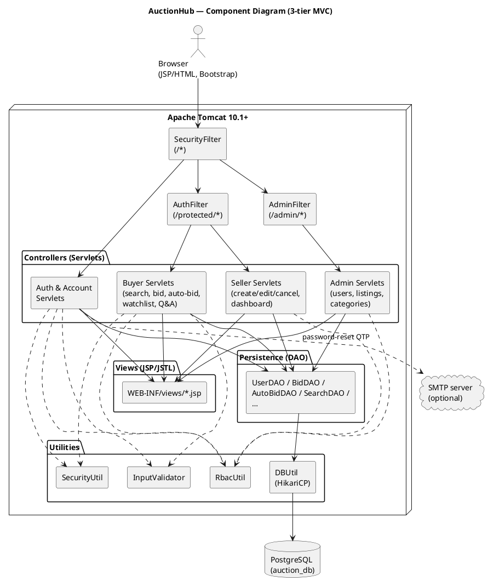
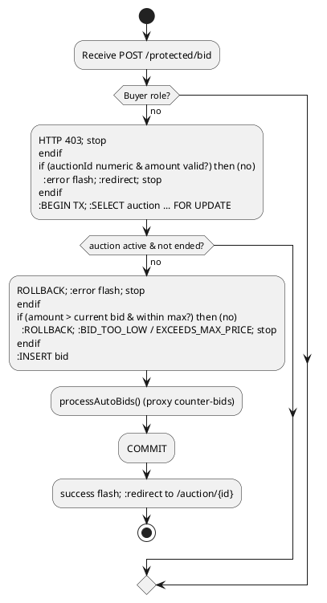
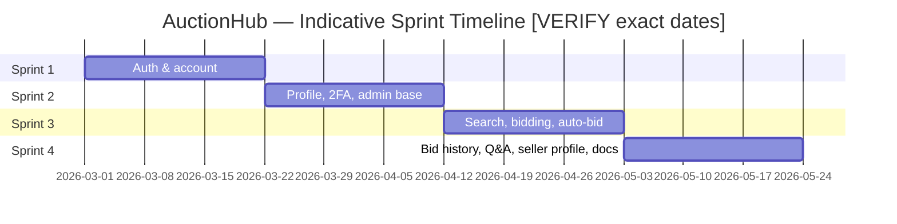

# Preliminary Technical Document

| | |
|---|---|
| **Document title** | Preliminary Technical Document |
| **Project name** | Online Auction Platform (AuctionHub) |
| **Repository** | FYP-26-S2-24 |
| **Document version** | 1.0 (Preliminary) |
| **Date** | June 2026 |
| **Team** | [VERIFY: team name] |
| **Team members & roles** | [VERIFY: roster — name, role] |

> **Scope note.** This document covers system architecture, design, testing and project management for the AuctionHub platform. The functional and non-functional **requirements specification is maintained separately** and is *not* reproduced here; this document references requirement / user-story identifiers (SCRUM-xx) for traceability only.

---

## Table of Contents

1. [Critical Requirement Deltas Since Last Submission](#1-critical-requirement-deltas-since-last-submission)
2. [System Architecture](#2-system-architecture)
3. [System Design](#3-system-design)
4. [System Testing](#4-system-testing)
5. [Project Management](#5-project-management)
6. [References](#6-references)
7. [Appendices](#7-appendices)

---

## 1. Critical Requirement Deltas Since Last Submission

> **Baseline note.** The exact date and contents of the previous submission baseline are **[VERIFY: date of last submission]**. The table below lists the **confirmed feature increments** that are present in the current codebase and version control, grouped by development sprint, so that assessors can identify what changed. If a formal prior baseline exists, deltas should be read relative to it.

### 1.1 Confirmed increments (delta table)

| Change ID | Area | Description | Impact | Status |
|-----------|------|-------------|--------|--------|
| SCRUM-21 | Admin | User **unban** action with pre-condition validation and audit logging | Adds reversible moderation; complements existing ban | Implemented + unit-tested |
| SCRUM-23 | Admin | **Category CRUD** (create/edit/soft-delete/restore) with slug + restrict-delete | New admin-managed taxonomy | Implemented + unit-tested |
| SCRUM-48 | Buyer | Public **keyword search** with pagination | Core discovery feature | Implemented + unit-tested |
| SCRUM-51 | Buyer | **Place bid** with transactional, row-locked persistence | Core auction function | Implemented + unit-tested |
| SCRUM-52 | Buyer | **Auto-bid / proxy bidding** with encrypted max amount + note | Competitive bidding automation | Implemented + unit-tested |
| SCRUM-58 | Buyer | Public **bid history** with masked usernames + pagination | Transparency before bidding | Implemented + unit-tested |
| SCRUM-59 | Buyer | **Multi-filter search** (price, condition, location, end window) | Refined discovery | Implemented + unit-tested |
| SCRUM-60 | Buyer | **Search sort** (newest, ending soon, price asc/desc) via whitelist | Refined discovery | Implemented + unit-tested |
| SCRUM-62 | Buyer/Seller | **Auction Q&A** (buyer asks, seller replies, ownership-checked) | Pre-sale communication | Implemented + unit-tested |
| SCRUM-63 | Public | Public **seller profile** with masked email + ratings | Trust / reputation | Implemented + unit-tested |
| SCRUM-73 | Buyer | **"Buyers who bid on this also bid on…"** strip on auction detail | Cross-sell / discovery | Implemented + unit-tested |
| SCRUM-74 | Buyer | **Dismiss recommendation** ("not interested"), excluded from future results | Feedback control; auth-gated | Implemented + unit-tested |
| SCRUM-75 | Admin | **Impression / click / conversion tracking** with per-arm CTR breakdown | Recommender measurement | Implemented + unit-tested |
| SCRUM-76 | Admin | **14 admin-tunable recommendation parameters** in `recommendation_settings` | Removes hardcoded ranking constants | Implemented + unit-tested |
| SCRUM-400 | Buyer | **Hybrid re-ranking**: four sequential stages become candidate generators feeding one weighted, min-max-normalised scoring pass, plus a category diversity cap and explainable per-card provenance | Ordering now reflects evidence rather than stage boundaries | Implemented + unit-tested (see §3.9) |
| (supporting) | Buyer | Watchlist, bidding history, rate seller, report seller | Engagement features | Implemented + unit-tested |
| (supporting) | Seller | Create / edit / cancel auction, seller dashboard, rate buyer | Seller lifecycle | Implemented; some views pending (see §3.8) |

### 1.2 Known design deltas affecting documentation

- **Search DAO signature evolved** from a 4-argument call to a 6-argument call `search(keyword, categoryName, SearchFilter, SearchSort, page, pageSize)` to accommodate SCRUM-59/60. Older unit-test mocks were migrated accordingly.
- **Username masking** was extended with `SecurityUtil.maskUsernameFully(...)` for non-leading bidders in public bid history (SCRUM-58).
- **Recommendation pipeline restructured** from a sequential slot-filling chain into four candidate generators plus a single re-ranking pass (SCRUM-400). `UserBasedCollaborativeFilter.rankAuctionIds` gained a six-argument overload taking an eligibility allow-set; the four- and five-argument forms remain as delegating wrappers (see §3.9.9, item 15). Arm attribution changed meaning in commit `5373d43`, which introduces a discontinuity in the click-through time series (§3.9.9, item 5).
- **Operational delta:** Tomcat may require an increased `maxHttpHeaderSize` when a development browser accumulates large cookies on `localhost`; otherwise requests fail with HTTP 400 *"Request header is too large"* (see §4.6 and the User Manual).

---

## 2. System Architecture

### 2.1 Three-tier client–server architecture

AuctionHub is a server-rendered Java web application deployed as a single WAR (`online-auction.war`) on Apache Tomcat. It follows a classic **three-tier** decomposition:

| Tier | Responsibility | Technology in this project |
|------|----------------|----------------------------|
| **Presentation (client)** | Renders HTML, collects user input, light client-side validation/countdown | Web browser; JSP + JSTL server-side templates; Bootstrap 5.3.3 and bootstrap-icons 1.11.3 (jsDelivr CDN); small page-specific JS |
| **Application (server)** | Request routing, authentication/authorisation, business logic, orchestration | Jakarta Servlets + Filters running in Tomcat 10.1+ (Servlet 6.x); `com.auction.servlet`, `com.auction.filter`, `com.auction.util` |
| **Data** | Persistent storage, relational integrity, transactions | PostgreSQL accessed via JDBC; connection pooling by HikariCP (`DBUtil`); DAO layer in `com.auction.dao` |

```
   ┌─────────────┐   HTTPS/HTTP    ┌──────────────────────────────┐   JDBC    ┌──────────────┐
   │   Browser   │ ───────────────▶│  Tomcat 10.1+ (Servlet cont.)│ ─────────▶│  PostgreSQL  │
   │ (JSP/HTML)  │ ◀─────────────── │  Filters → Servlets → DAOs   │ ◀───────── │  auction_db  │
   └─────────────┘   HTML response  └──────────────────────────────┘  ResultSet └──────────────┘
                                      ▲ HikariCP pool (DBUtil)
```

The platform does **not** use any machine-learning or neural-network component; that architectural style is **Not Applicable** to this project. The system is deliberately a conventional transactional web application. The recommendation subsystem (§3.9) is the only component that ranks rather than merely retrieves, and it is not an exception to this: it is pure SQL over existing tables plus a deterministic scoring function, with no trained model, no fitted parameter and no model artefact.

### 2.2 MVC mapping

Within the application tier, the project applies the **Model–View–Controller** pattern, augmented by a dedicated **DAO** persistence layer and cross-cutting **Filters**:

| MVC role | Java package / location | Examples |
|----------|-------------------------|----------|
| **Controller** | `com.auction.servlet` (+ `.admin`, `.seller`) | `LoginServlet`, `PlaceBidServlet`, `SearchServlet`, `AdminCategoriesServlet` |
| **Model (domain)** | `com.auction.model` (+ `.admin`, `.seller`, `.profile`) | `User`, `Auction`, `AuctionDetail`, `Bid`, enums `Role`/`Status`/`SearchSort` |
| **Persistence (DAO)** | `com.auction.dao` | `UserDAO`, `BidDAO`, `AutoBidDAO`, `SearchDAO` |
| **View** | `src/main/webapp/WEB-INF/views/*.jsp` | `auction-detail.jsp`, `search.jsp`, `admin/dashboard.jsp` |
| **Cross-cutting** | `com.auction.filter` | `SecurityFilter`, `AuthFilter`, `AdminFilter` |
| **Utilities** | `com.auction.util` | `SecurityUtil`, `InputValidator`, `RbacUtil`, `DBUtil`, `TotpUtil`, `OtpStore`, `MailConfig` |

A typical request flows: **Browser → Filter chain → Servlet (controller) → DAO → PostgreSQL → DAO → Servlet → JSP (view) → Browser.** Servlets never embed SQL; all data access is delegated to DAOs that use `PreparedStatement`.

### 2.3 Request routing and access tiers

Routing is declared with `@WebServlet` / `@WebFilter` annotations (component scanning); `WEB-INF/web.xml` contains only an `uploadDir` context parameter. There are three access tiers enforced by URL prefix:

| URL space | Filter | Access policy |
|-----------|--------|---------------|
| Public (e.g. `/`, `/search`, `/auction/*`, `/auction-bids`, `/seller/*`, `/login`, `/register`) | `SecurityFilter` only | No authentication required |
| `/protected/*` | `SecurityFilter` + `AuthFilter` | Authenticated session required; otherwise redirect to `/login` |
| `/admin`, `/admin/*` | `SecurityFilter` + `AdminFilter` | Authenticated **and** `Role.ADMIN`; non-admins receive HTTP 403 |

`SecurityFilter` (`/*`) sets security response headers on **every** request: `X-Content-Type-Options: nosniff`, `X-Frame-Options: DENY`, `X-XSS-Protection: 1; mode=block`, and a Content-Security-Policy permitting `self` plus `cdn.jsdelivr.net` for styles/scripts/fonts.

### 2.4 UML component diagram

The following PlantUML component diagram summarises the deployable components and their dependencies. (Render with PlantUML; the project's authoritative class-level model is `docs/class-diagrams/SCRUM-297-mvc-master-class-diagram.puml`.)


```plantuml
@startuml AuctionHub-Component
title AuctionHub — Component Diagram (3-tier MVC)

skinparam componentStyle rectangle

actor "Browser\n(JSP/HTML, Bootstrap)" as Browser

node "Apache Tomcat 10.1+" {
  component "SecurityFilter\n(/*)" as SF
  component "AuthFilter\n(/protected/*)" as AF
  component "AdminFilter\n(/admin/*)" as ADF

  package "Controllers (Servlets)" {
    component "Auth & Account\nServlets" as CAuth
    component "Buyer Servlets\n(search, bid, auto-bid,\nwatchlist, Q&A)" as CBuyer
    component "Seller Servlets\n(create/edit/cancel,\ndashboard)" as CSeller
    component "Admin Servlets\n(users, listings,\ncategories)" as CAdmin
  }

  package "Views (JSP/JSTL)" {
    component "WEB-INF/views/*.jsp" as Views
  }

  package "Persistence (DAO)" {
    component "UserDAO / BidDAO /\nAutoBidDAO / SearchDAO /\n…" as DAO
  }

  package "Utilities" {
    component "SecurityUtil" as SU
    component "RbacUtil" as RB
    component "InputValidator" as IV
    component "DBUtil\n(HikariCP)" as DB
  }
}

database "PostgreSQL\n(auction_db)" as PG
cloud "SMTP server\n(optional)" as SMTP

Browser --> SF
SF --> AF
SF --> ADF
SF --> CAuth
AF --> CBuyer
AF --> CSeller
ADF --> CAdmin
CAuth --> Views
CBuyer --> Views
CSeller --> Views
CAdmin --> Views
CAuth --> DAO
CBuyer --> DAO
CSeller --> DAO
CAdmin --> DAO
DAO --> DB
DB --> PG
CAuth ..> SU
CBuyer ..> SU
CAuth ..> RB
CBuyer ..> RB
CSeller ..> RB
CAdmin ..> RB
CAuth ..> IV
CBuyer ..> IV
CAuth ..> SMTP : password-reset OTP
@enduml
```

### 2.5 Why MVC + DAO (design rationale)

- **Separation of concerns:** Controllers handle HTTP and orchestration; DAOs isolate SQL; JSPs handle presentation. This makes servlets unit-testable with mocked DAOs (see §4).
- **Testability:** Every servlet exposes a DAO-injection constructor, enabling Mockito-based unit tests without a live database.
- **Security containment:** All SQL is parameterised inside DAOs; masking/encryption is centralised in `SecurityUtil`; RBAC is centralised in `RbacUtil` and the filter layer.
- **No ML/neural-net architecture** is used — the domain (auctions, bids, moderation) is transactional and rule-based, so a relational + MVC design is the appropriate, lower-risk choice.

---

## 3. System Design

### 3.1 Database schema and ERD

The authoritative schema is `FYP/src/main/resources/auction_db.sql`, extended by migration scripts under `FYP/src/main/resources/db/`. The ERD is maintained as `docs/database/SCRUM-297-postgresql-erd.puml`.

**Core entities** (selected columns):

| Table | Key columns | Purpose |
|-------|-------------|---------|
| `users` | `id` PK; `email` UQ; `username` UQ; `password`; `role_id` FK→`roles`; `status_id` FK→`user_status`; `two_factor_secret`; `phone_encrypted`; `address_encrypted` | Accounts; encrypted PII at rest |
| `auction` | `auction_id` PK; `seller_id` FK→`users`; `status_id` FK→`auction_status`; `auction_type` FK→`auction_type`; `date_end`; `report_count`; `moderation_state` CHECK(active/flagged/removed) | Auction header + moderation state |
| `auction_details` | `id` PK/FK→`auction` (1:1); `title`; `description`; `category`; `item_condition_id` FK→`item_status`; `starting_price`; `max_price`; `winning_bid`; `winner_id` | Auction body + pricing |
| `auction_images` | `id` PK; `auction_id` FK | 1:N images |
| `auction_tag_info` | (`auction_id`,`tag_id`) composite PK/FK | M:N auctions↔`tags` |
| `bids` | `bid_id` PK; `auction_id` FK; `user_id` FK; `bid_amount` NUMERIC(10,2) CHECK≥0; `bid_time` | Bid ledger |
| `auto_bids` | `id` PK; (`auction_id`,`user_id`) UQ; `max_amount_enc`; `note_enc` | Encrypted proxy-bid ceilings |
| `auction_questions` | `id` PK; `auction_id` FK; `asker_user_id` FK; `question_text`; `answer_text`; `answered_at` | Q&A threads |
| `categories` | `id` PK; `name` UQ; `slug` UQ; `is_deleted` | Admin taxonomy (soft-delete) |
| `user_reviews` | `id` PK; `reviewer_user_id` FK; `reviewee_user_id` FK; `auction_id` FK; `rating` CHECK 1–5; UQ(`auction_id`,`reviewer_user_id`) | Bi-directional ratings |
| `watchlist` | `id` PK; (`user_id`,`auction_id`) UQ | Saved auctions |
| `seller_reports` / `account_reports` | report rows; UQ per reporter pair | Abuse reporting |
| `browse_history` | `id` PK; `user_id` FK; `auction_id` FK; `viewed_at` | Page-view signal for the recommender (no unique constraint — repeat views are separate rows) |
| `recommendation_events` | `id` PK; `user_id` (no FK, may be NULL for guests); `auction_id`; `event_type` CHECK(IMPRESSION/CLICK); `source_keyword`; `reason_code`; `created_at` | Impression/click ledger; `reason_code` names the pipeline arm (§3.9.8) |
| `recommendation_settings` | `key` PK; `value`; `updated_at` | 14 admin-tunable ranking parameters (§3.9.4) |
| `dismissed_recommendations` | `id` PK; (`user_id`,`auction_id`) UQ | "Not interested" exclusions (SCRUM-74) |
| `search_history` | `id` PK; `user_id` (nullable, no FK); `keyword`; `created_at` | Search terms used for keyword attribution on recommendation cards |
| `landing_content` | `content_key` PK; `content_value`; `default_value`; `label` | Admin-editable landing-page copy, including all recommendation headings and subtitles |

**Lookup/reference tables (seeded):** `roles` (Admin/Buyer/Seller), `user_status` (Active/Suspended/Deleted), `categories` (7 rows via migration). `auction_status`, `auction_type`, `item_status` are referenced by ID and **[VERIFY: seed rows for these lookup tables are not in the SQL files — confirm they are inserted manually or by the application]**.

**Indexes (non-PK):** `idx_auction_details_title` (LOWER(title)), `idx_auction_moderation_end` (`moderation_state`,`date_end`), `idx_auto_bids_auction`, `idx_auction_questions_auction`.

**Migration scripts** (`db/`): `migration_admin_moderation.sql`, `migration_auction_questions.sql`, `migration_auto_bids.sql`, `migration_categories.sql`, `migration_search_index.sql`, `migration_seller_features.sql`, `migration_seller_ratings.sql`, `migration_seller_reports.sql`, `migration_user_reviews.sql`, `migration_watchlist.sql`.

**Recommendation migrations** (`db/`), applied in this order by `migrate_all.sql`, each additive and safe to re-run: `migration_recommendation_features.sql` (dismissals, events, settings table), `migration_recommendation_explainability.sql` (`search_history`, `source_keyword`), `migration_recommendation_weights.sql` (`w_bid`/`w_watchlist`/`w_browse`), `migration_recommendation_trending_window.sql`, `migration_recommendation_recency.sql` (`recency_tau_days`, `content_window_days`), `migration_recommendation_hybrid_rerank.sql` (five re-ranking weights + diversity divisor), `migration_recommendation_arm_labels.sql` (`reason_code`). `reason_code` deliberately carries **no** `CHECK` constraint: the arm names are validated in Java against the `Reason` enum, and a database-level whitelist would require a migration every time a stage is added. See §3.9.4.

> **Design note.** `auction_details.category` is a free-text string and is **not** a foreign key to `categories`; the normalised `categories` table is used by the admin taxonomy and matched by name/slug by convention.

### 3.2 UML class diagram

The MVC master class diagram is `docs/class-diagrams/SCRUM-297-mvc-master-class-diagram.puml` (v1.1). It groups types into Model, DAO, Controller (Servlet/Filter), View and Util layers. Key relationships:

- Servlets depend on one or more DAOs (constructor-injected) and on `SecurityUtil` / `RbacUtil` / `InputValidator`.
- DAOs depend on `DBUtil` for pooled connections and return Model objects / projection rows.
- Enums (`Role`, `Status`, `AuctionStatus`, `ItemCondition`, `SearchSort`) encode controlled vocabularies and map to lookup tables or fixed IDs.

### 3.3 Sequence diagrams

Feature flows are documented as PlantUML under `docs/sequence-diagrams/`:

| Feature | Diagram file | Flow summary |
|---------|--------------|--------------|
| Logout | `SCRUM-7-logout-sequence.puml` | Invalidate session → redirect `/login`; post-logout `/protected/*` blocked |
| Account management | `SCRUM-8-account-management.puml` | Load dashboard with decrypted PII for owner |
| Account deletion | `SCRUM-9-account-deletion.puml` | Confirm → anonymise PII → set DELETED → invalidate session |
| Profile update | `SCRUM-11-profile-update.puml` | Validate → encrypt PII → persist |
| Change password | `SCRUM-12-change-password.puml` | Verify current → hash new → invalidate session |
| Admin unban | `SCRUM-21-unban-sequence.puml` | Validate state → transactional status update → audit log |
| Category CRUD | `SCRUM-23-category-crud-sequence.puml` | Create/edit/soft-delete/restore with duplicate + restrict-delete checks |
| Search | `SCRUM-48-search-sequence.puml` | Validate query → `SearchDAO.search/count` → results page |
| Bidding | `SCRUM-51-bidding-sequence.puml` | Lock auction row (FOR UPDATE) → validate → insert bid → process auto-bids |
| Auto-bid | `SCRUM-52-auto-bid-sequence.puml` | Encrypt ceiling → proxy-bid resolution loop |
| Bid history | `SCRUM-58-auction-bid-history-sequence.puml` | Determine leader → mask usernames → paginate |
| Search filter | `SCRUM-59-search-filter-sequence.puml` | Parse + validate filters → bound params to DAO |
| Search sort | `SCRUM-60-search-sort-sequence.puml` | Whitelist `sortBy` → fixed ORDER BY fragment |
| Auction Q&A | `SCRUM-62-auction-question-sequence.puml` | Buyer ask / seller reply with ownership checks |
| Seller profile | `SCRUM-63-seller-profile-sequence.puml` | Active-seller lookup → masked email → paginated reviews |
| Recommendation pipeline | `SCRUM-400-recommendation-pipeline-sequence.puml` | Guest vs registered branch → four candidate generators → weighted re-ranking → category cap → `attachProvenance` → impression/click feedback into `recommendation_events` (see §3.9) |
| Telegram notifications | `telegram-notifications-sequence.puml` | Outbound bid/outbid/win notification dispatch |

### 3.4 Use case descriptions

Representative use cases (actors, pre/post-conditions, flows). These describe behaviour, not requirements.

**UC-01 Place Bid**
- **Actor:** Buyer (authenticated, not the seller)
- **Preconditions:** Auction exists, is `active` moderation state, not ended; user has Buyer role.
- **Main flow:** Buyer enters amount on auction detail → confirms in modal → `POST /protected/bid` → `BidDAO.placeBid` locks the auction row, validates floor/max/self-bid, inserts bid, runs auto-bid resolution → redirect back with success flash.
- **Postconditions:** New row in `bids`; current bid updated; any triggered proxy counter-bids inserted.
- **Exceptions:** `BID_TOO_LOW`, `EXCEEDS_MAX_PRICE`, `AUCTION_CLOSED`, `AUCTION_REMOVED`, `SELF_BID`, `AUCTION_NOT_FOUND` → error flash.

**UC-02 Set Auto-Bid**
- **Actor:** Buyer. **Preconditions:** Open auction, not own auction, max > current bid.
- **Main flow:** `POST /protected/auto-bid` (action=SET) → `AutoBidDAO.upsert` encrypts max amount and optional note → success flash. action=CANCEL deletes the row.
- **Postconditions:** Encrypted ceiling stored (unique per auction+user).
- **Exceptions:** ended/cancelled auction, max ≤ current bid, seller on own auction → error flash.

**UC-03 Search Auctions**
- **Actor:** Public visitor. **Preconditions:** none.
- **Main flow:** `GET /search?q=…` (+ optional category, filters, sortBy, page) → query validated/sanitised → `SearchDAO.search`/`count` (only active, non-expired auctions) → results page with pagination.
- **Exceptions:** Blank query redirects home; invalid filters silently dropped.

**UC-04 View Bid History**
- **Actor:** Public visitor. **Preconditions:** auction exists.
- **Main flow:** `GET /auction-bids?auctionId=…&page=&size=` → existence check → leader determined → usernames masked (leader partial, others full) → paginated table.
- **Exceptions:** missing/invalid `auctionId` → 400; unknown auction → 404; no bids → empty state.

**UC-05 Ask / Answer Question**
- **Actors:** Buyer (ask), Seller (reply). **Preconditions:** open auction; seller owns auction to reply.
- **Main flow:** `POST /protected/auction-question` (ASK or REPLY) → validate + sanitise text → `QuestionDAO.insertQuestion`/`insertReply` (ownership + state checks) → redirect to `/auction/{id}#questions`.
- **Exceptions:** `SELF_QUESTION`, `AUCTION_CLOSED`, `NOT_SELLER`, `ALREADY_ANSWERED`.

**UC-06 Admin Ban / Unban User**
- **Actor:** Admin. **Preconditions:** target is a non-admin, non-self account.
- **Main flow:** `POST /admin/users/action` (suspend / active|unban) → state pre-condition validated → status updated → audit log + flash.
- **Exceptions:** already-banned, already-active, deleted account, admin target, self-action → error.

**UC-07 Admin Manage Categories**
- **Actor:** Admin.
- **Main flow:** `POST /admin/categories` (CREATE/EDIT/DELETE/RESTORE) → name/slug duplicate checks; delete is restricted if auctions reference the category → soft-delete toggles `is_deleted`.

**UC-08 Register / Login / Logout**
- **Actor:** Visitor / user.
- **Main flow:** Register validates fields, hashes password, inserts user. Login verifies password, sets session attributes (incl. masked email/username), redirects by role. Logout invalidates the session.
- **Exceptions:** duplicate email/username, weak password, suspended/deleted account, invalid credentials.

**UC-09 Reset Password (OTP)**
- **Actor:** User. **Main flow:** `/forgot-password` generates a 6-digit OTP (5-min TTL) emailed via SMTP if configured, otherwise shown in-page (dev) → `/reset-password` verifies OTP and stores new salted hash.

**UC-10 Create / Edit / Cancel Auction**
- **Actor:** Seller. **Main flow:** create with images/tags (transactional); edit only while zero bids; cancel ACTIVE/PENDING auctions with reason.

**UC-11 Watchlist**
- **Actor:** Buyer. **Main flow:** add/remove auctions; cannot watch own auction; unique per user+auction.

**UC-12 Rate Seller / Buyer**
- **Actors:** Buyer rates seller; seller rates winning buyer after a finished auction; score 1–5; one review per auction per reviewer.

### 3.5 Activity diagrams (key flows)

**Place Bid (textual + PlantUML).**


```plantuml
@startuml PlaceBid-Activity
start
:Receive POST /protected/bid;
if (Buyer role?) then (no)
  :HTTP 403; stop
endif
if (auctionId numeric & amount valid?) then (no)
  :error flash; :redirect; stop
endif
:BEGIN TX; :SELECT auction ... FOR UPDATE;
if (auction active & not ended?) then (no)
  :ROLLBACK; :error flash; stop
endif
if (amount > current bid & within max?) then (no)
  :ROLLBACK; :BID_TOO_LOW / EXCEEDS_MAX_PRICE; stop
endif
:INSERT bid;
:processAutoBids() (proxy counter-bids);
:COMMIT;
:success flash; :redirect to /auction/{id};
stop
@enduml
```

**Auto-bid resolution (summary).** `AutoBidDAO.resolveNextAutoBid` is a pure function: given the current floor, the set of competing encrypted ceilings (decrypted), and the current top bidder, it determines whether a counter-bid fires and at what amount (floor + 0.01, leapfrogging competitors, capped at the winner's ceiling, FIFO tie-break by `created_at`). The loop runs up to 50 rounds within the same transaction as `placeBid`.

**Search with filters (summary).** Parse `q` (validated, max 200 chars) → parse optional category slug (resolved to name) → parse filters (invalid values silently dropped) → resolve `sortBy` against the `SearchSort` whitelist → call `SearchDAO.search/count` with bound parameters → forward to `search.jsp`.

### 3.6 Functional hierarchy

The hierarchy is organised by **actor and access tier**, so that what an unregistered visitor can reach is visible at a glance rather than inferred. Nodes marked *(read-only)* are available without a session; every interactive node below the Public branch requires authentication, enforced by the filter/`requireAuth` layer of §2.3 and not merely by hiding the control.

```
AuctionHub
├── Public — unregistered visitor (read-only, no session)
│   ├── Browse landing page
│   │   ├── Categories, Featured listings, Fee schedule, Testimonials
│   │   ├── Trending Auctions strip                     (non-personalised, DB-ranked)
│   │   └── "Popular Right Now" strip                   (recommender in cold-start mode)
│   ├── Search (keyword / category / filters / sort)
│   ├── Auction detail, Bid history (masked usernames)
│   ├── "Buyers who bid on this also bid on…"           (SCRUM-73)
│   ├── Public seller profile
│   └── ✗ NOT available to guests: place bid, auto-bid, watchlist, dismiss a
│         recommendation, ask a question, rate, report, personalised ranking
├── Authentication & Account
│   ├── Register / Login / Logout
│   ├── Forgot / Reset password (OTP)
│   ├── Two-factor (TOTP)         [VERIFY: TwoFactorServlet present but not URL-mapped]
│   ├── View / Edit profile, Change password
│   └── Delete account (PDPA anonymisation)
├── Buyer (authenticated)
│   ├── Search (keyword / category / filters / sort)
│   ├── Auction detail, Bid history
│   ├── Place bid, Auto-bid
│   ├── Watchlist, Bidding history
│   ├── Ask question, Rate seller, Report seller
│   ├── Public seller profile
│   └── Personalised recommendations                    (§3.9)
│       ├── "Recommended for You" strip
│       ├── Candidate generation
│       │   ├── Peer bids — item-based CF               (PEER_BIDS)
│       │   ├── Similar taste — user-based CF, cosine   (SIMILAR_TASTE)
│       │   ├── Content match — category / tag          (SAME_CATEGORY)
│       │   └── Trending — recent bid count             (TRENDING)
│       ├── Hybrid re-ranking + category diversity cap
│       ├── "Why this?" explanation per card
│       │   ├── Reason sentence + match score + dominant component
│       │   └── Aggregate click evidence + masked clicker + keywords
│       └── Dismiss recommendation ("not interested")   (SCRUM-74)
├── Seller
│   ├── Create / Edit / Cancel auction
│   ├── Seller dashboard
│   ├── Reply to questions
│   └── Rate buyer
└── Admin
    ├── Dashboard (metrics, activity)
    ├── User moderation (ban / unban)
    ├── Listing moderation (flag / remove / restore)
    ├── Category CRUD
    ├── Landing content editor                          (all landing copy is DB-driven)
    └── Analytics
        ├── User activity / Revenue / Moderation reports
        └── Recommendation analytics                    (§3.9.4, §3.9.8)
            ├── Pooled impressions / clicks / CTR / conversion
            ├── Per-arm CTR breakdown incl. TRENDING_CONTROL baseline
            ├── Per-user attribution detail              (ADMIN only — §3.9.6)
            └── 14 tunable parameters (page size, threshold, windows,
                interaction weights, decay τ, re-ranking weights, diversity cap)
```

### 3.7 Data flow (DFD)

**Context (Level 0).**

```
        ┌──────────────────────────────────────────┐
 Visitor│                                          │ Email (OTP)
 Buyer ─▶│            AuctionHub System             │──────────▶ SMTP server (optional)
 Seller │  (Tomcat web app + PostgreSQL database)   │
 Admin ─▶│                                          │
        └──────────────────────────────────────────┘
              ▲ requests            ▼ HTML pages
            users (browser)      rendered views
```

**Level 1 (selected processes).**

```
Buyer ──(bid request)──▶ [P1 Place Bid] ──(insert)──▶ {D: bids}
                              │ reads/locks ──▶ {D: auction, auction_details}
                              └─(process)──▶ [P2 Auto-bid] ──(counter-bids)──▶ {D: bids}

Visitor ─(query+filters)─▶ [P3 Search] ──(SELECT)──▶ {D: auction, auction_details, bids}
                                         └─(results)──▶ Visitor

Admin ──(moderate)──▶ [P4 User/Listing/Category Admin] ──▶ {D: users, auction, categories}
```

### 3.8 UX: sitemap, navigation and wireframes

**Sitemap (implemented routes → views).**

```
/                         → index.jsp (landing)
/search                   → search.jsp
/auction/{id}             → auction-detail.jsp
/auction-bids?auctionId=  → auction-bid-history.jsp
/seller/{id}              → seller-profile.jsp
/login /register
/forgot-password /reset-password   → auth/*.jsp
/protected/account        → account/dashboard.jsp
/protected/account/edit   → account/edit.jsp
/protected/account/password → account/change-password.jsp
/admin/dashboard|users|listings|categories|analytics → admin/*.jsp
/protected/seller/auctions     → [VERIFY: seller/auctions.jsp view not yet present]
/protected/bidding-history     → [VERIFY: bidding-history.jsp view not yet present]
/protected/watchlist           → [VERIFY: watchlist.jsp view not yet present]
/seller/edit-auction           → [VERIFY: seller/edit-auction.jsp view not yet present]
```

> **Implementation gap (honest disclosure).** Four servlets forward to JSP views that are **not yet present** in `webapp` (seller dashboard, edit-auction, bidding-history, watchlist). Their controllers and DAO methods are implemented and unit-tested, but the corresponding pages would currently fail to render. These are tracked as outstanding view work.

**Navigation structure.**
- `home-navbar.jsp` (public/sticky): brand, Explore, Sell Items, Help, search box (`GET /search`), sign-in/account, client-side category pills.
- `navbar.jsp` (account chrome): Home, My Account, Admin (admins only), masked username + Logout.
- `admin-sidebar.jspf`: Overview, User Moderation, Listing Moderation, Categories, Analytics, with active-state highlighting.

**Wireframe — Search results (`search.jsp`).**

```
┌───────────────────────────── home-navbar ─────────────────────────────┐
│ AuctionHub │ Explore  Sell  Help │  [ search q ............. 🔍 ] │ Sign in │
├───────────────────────────────────────────────────────────────────────┤
│ Results for "laptop"                                  12 listings found │
│ [active filter badges]                                  [Clear filters] │
│ ┌──────────────┐  ┌────────────────────────────────────────────────┐  │
│ │ FILTERS      │  │ Sort: [Newly listed ▾]                          │  │
│ │ Price min/max│  │ ┌─────────┐ ┌─────────┐ ┌─────────┐             │  │
│ │ Condition ▾  │  │ │ [img]   │ │ [img]   │ │ [img]   │   cards…     │  │
│ │ Location     │  │ │ title   │ │ title   │ │ title   │             │  │
│ │ Ending ▾     │  │ │ seller  │ │ seller  │ │ seller  │             │  │
│ │ [Apply][Reset]│  │ │ $bid View│ │ $bid View│ │ $bid View│            │  │
│ └──────────────┘  │ └─────────┘ └─────────┘ └─────────┘             │  │
│                   │ « Prev   1 2 3   Next »                          │  │
└───────────────────────────────────────────────────────────────────────┘
```

**Wireframe — Auction detail (`auction-detail.jsp`).**

```
┌───────────────────────────── home-navbar ─────────────────────────────┐
│ [bid success / error flash]                                            │
│ ┌───────────────────────────────┐ ┌──────────────────────────────────┐│
│ │  MAIN IMAGE (420px)            │ │ [category badge]                 ││
│ │  [thumb][thumb][thumb]         │ │ Title (h3)                       ││
│ │                                │ │ Sold by → seller profile link    ││
│ │  Description ……                │ │ ┌── BID CARD ──────────────────┐ ││
│ │                                │ │ │ Current bid  $1,250.00        │ ││
│ │                                │ │ │ Starting $… • N bids          │ ││
│ │                                │ │ │ Ends 2d 4h 11m                │ ││
│ │                                │ │ │ [ $ amount ] [ Place Bid ]    │ ││
│ │                                │ │ └───────────────────────────────┘ ││
│ │                                │ │ ▸ Set Maximum Auto-Bid (accordion)││
│ └───────────────────────────────┘ └──────────────────────────────────┘│
│ Bid History            [Full list →]                                   │
│  Bidder        | Amount    | Time          (leading row highlighted)   │
│  « Prev 1 2 Next »   Showing page 1 of 2                               │
│ Questions & Answers                                                    │
│  [asker] question…  → [seller reply]   |  [Ask a question] textarea    │
│ [MODAL] Confirm Your Bid — amount — [Cancel][Confirm Bid]              │
└───────────────────────────────────────────────────────────────────────┘
```

**Wireframe — Login (`auth/login.jsp`).**

```
┌──── auth-brand-header (AuctionHub) ────┐
│            Sign in your account         │
│   [Create Account]                      │
│   [ error alert (optional) ]            │
│   Email     [........................]  │
│   Password  [........................]  │
│   [        Login        ]               │
│   □ Remember me        Forgot password? │
└─────────────────────────────────────────┘
```

**Wireframe — Account dashboard (`account/dashboard.jsp`).**

```
┌── navbar (dark) ──────────────────────────────────────────────┐
│ User Profile                          [Profile] [Settings]     │
│ ┌── LEFT (4) ──────────┐ ┌── RIGHT (8) ───────────────────────┐│
│ │ avatar               │ │ [Transaction History | Reviews]    ││
│ │ username             │ │ Filter: [All ▾]                    ││
│ │ member since         │ │ ID | Date | Item | Type | Amt | St ││
│ │ masked email/phone   │ │ …                                  ││
│ │ [Edit profile]       │ │ Totals: purchases / sales / volume ││
│ │ Ratings ★★★★☆        │ │ ──────────────────────────────────  ││
│ │ Private info (full)  │ │ Danger zone [Delete my account]    ││
│ └──────────────────────┘ └────────────────────────────────────┘│
└────────────────────────────────────────────────────────────────┘
```

**Wireframe — Admin dashboard (`admin/dashboard.jsp`).**

```
┌── sidebar ──┬──────────────── main ──────────────────────────┐
│ Overview    │ Dashboard Overview                              │
│ Users       │ [Total Users] [Active Listings] [Flagged] [Rev]│
│ Listings    │ ┌ Users preview ─────┐ ┌ Listings preview ────┐│
│ Categories  │ │ User|Status|Role   │ │ Title|Reports|Status ││
│ Analytics   │ └────────────────────┘ └──────────────────────┘│
│ Account     │ Recent Activity: ● message …… time             │
│ Log out     │                                                 │
└─────────────┴─────────────────────────────────────────────────┘
```

**Wireframe — Seller public profile (`seller-profile.jsp`).**

```
┌── home-navbar ───────────────────────────────────────────────┐
│ ( avatar ) username  • masked email • member since   ★★★★☆ (N)│
│ Active listings: N                                            │
│ Review History                                                │
│  ★★★★★ [masked reviewer]            date                      │
│  Re: {auction title}                                          │
│  comment text …                                               │
│  « Prev 1 2 Next »                                            │
└───────────────────────────────────────────────────────────────┘
```

Styling: Bootstrap 5.3.3 + bootstrap-icons 1.11.3 (jsDelivr CDN) on all pages; local CSS under `webapp/css/` (`home.css`, `auth.css`, `profile.css`, `admin.css`); `auction-detail.jsp` uses inline styles.

### 3.9 Recommendation subsystem

The recommendation subsystem is the most algorithmically substantial part of the platform, and it is the one place where the system does more than read and write rows. It is therefore documented here in more depth than the other design sections, including the parts of it that do not work as well as one might wish (§3.9.9) and the designs that were considered and turned down (§3.9.10). This is the only section deep enough to warrant a fourth heading level.

Two points of orientation before the detail:

- **This is not machine learning.** §2.1 and §2.5 state that no ML or neural-network architecture is used, and that remains true. The recommender is pure SQL over existing tables plus a deterministic scoring function in Java. Nothing is trained, no parameter is fitted, and there is no model artefact — every number that influences the ranking is either read from a database row an administrator can edit or derived arithmetically from the interaction data at request time. That is a deliberate scope choice, and its main consequence is set out honestly in §3.9.9.
- **Every user-visible string is database-driven.** Section headings, subtitles, card call-to-action labels and the cold-start prompt all come from the `landing_content` table, and every parameter that changes the ranking comes from `recommendation_settings`. Nothing on the strip is a constant a programmer chose and buried in a source file. §3.9.4 is the direct answer to that criticism.

**Source files.**

| Concern | File |
|---------|------|
| Pipeline, generators, re-ranking, settings, metrics | `com.auction.dao.RecommendationDAO` |
| Cosine similarity and neighbourhood ranking | `com.auction.util.UserBasedCollaborativeFilter` |
| Public + admin endpoints | `com.auction.servlet.api.RecommendationApiServlet` |
| Admin config + per-arm metrics endpoint | `com.auction.servlet.api.AdminApiServlet` |
| Explanation payload | `com.auction.model.RecommendationProvenance` |
| Landing strip, impression/click instrumentation | `Frontend/src/pages/Home.jsx`, `Frontend/src/api/auction.js` |
| "Why this?" panel | `Frontend/src/components/AuctionCard.jsx` |
| Per-arm CTR table + settings form | `Frontend/src/pages/admin/AdminAnalytics.jsx` |
| Admin-only per-user attribution | `Frontend/src/pages/admin/RecommendationAttributionPanel.jsx` |
| Schema | `db/migration_recommendation_{features,explainability,weights,trending_window,recency,hybrid_rerank,arm_labels}.sql` |

The end-to-end request path, including the impression/click feedback loop, is `docs/sequence-diagrams/SCRUM-400-recommendation-pipeline-sequence.puml`.

#### 3.9.1 Candidate generation — four arms

The pipeline originally ran four stages in sequence, each filling whatever slots the previous one left. The final ordering was therefore decided by stage boundaries rather than by any score: an auction that three signals agreed on weakly could sit below one that a single signal happened to like, purely because the second signal's stage ran first. The four stages are now **candidate generators**. None of them is told what an earlier one has already taken, because an auction several signals agree on has to reach the re-ranker from all of them; excluding it after the first sighting is exactly what made the order a function of stage sequence instead of evidence.

Each generator is asked for `pool = limit × 2 + |dismissed|` candidates (`CANDIDATE_MULTIPLIER = 2`), so the re-ranker has roughly two pages' worth to choose between without turning four bounded queries into four unbounded ones.

| Generator | Reason code | Component | Signal read | Ordering inside the stage |
|-----------|-------------|-----------|-------------|---------------------------|
| `collaborativeFiltering()` | `PEER_BIDS` | `CF` | Peer co-occurrence. `my_items` = the viewer's bids ∪ watchlist; `peers` = every other user who bid on or watchlisted one of them; each candidate scores the number of **distinct** peers who bid on or watchlist it | co-bidder count desc, then soonest-ending |
| `userBasedCosineRecommendations()` | `SIMILAR_TASTE` | `UBCF` | Bids, watchlist **and** browse history for every user, recency-decayed, compared by cosine similarity (§3.9.3) | neighbourhood score desc |
| `contentBased()` | `SAME_CATEGORY` | `CONTENT` | The viewer's own bids / watchlist / browse rows inside `content_window_days`, reduced to a set of categories and a set of tags; candidates share at least one | soonest-ending only — there is no relevance order here |
| `trending()` | `TRENDING` | `POPULARITY` | Count of bids placed inside `trending_window_days` | bid count desc, then soonest-ending |

Two details are worth stating because they are the kind of thing an assessor will probe:

- The peer-CF stage counts **distinct peers**, not bid rows. Counting rows let one determined bidder placing twenty bids outrank a listing several different peers had agreed on. The same scoring is used by `similarByBidders()` behind the auction detail page's "buyers who bid on this also bid on…" strip.
- The content-based stage orders only by `date_end`. It has no notion of *how* strongly a candidate matches, only that it matches. That is precisely why the diversity cap in §3.9.2 exists: without it, a viewer who opened a single Electronics listing could watch soon-ending Electronics take every remaining slot.

A fifth component, `RECENCY`, is carried by every candidate and generated by no stage — see §3.9.2. A sixth reason code, `SEARCH_KEYWORD`, is likewise not a generator: it is applied after ranking by `attachProvenance()` when one of the viewer's own recent searches explains a card that some other stage already produced.

#### 3.9.2 Hybrid re-ranking

The union of the four candidate sets is scored in a single pass:

```
                 w_cf·ĉf(i) + w_ubcf·ûb(i) + w_content·ĉt(i) + w_pop·p̂op(i) + w_rec·r̂ec(i)
     score(i) = ───────────────────────────────────────────────────────────────────────────
                              Σ w_k  over components k carrying any signal at all
```

Each component is **min-max normalised across the candidate set** before it is weighted, so five signals produced in five different units are compared on one scale:

```
     x̂_k(i) = ( x_k(i) − min_j x_k(j) ) / ( max_j x_k(j) − min_j x_k(j) )
```

Two degenerate cases are answered rather than divided through. A component that no candidate carries (`max ≤ 0`) normalises to zero everywhere, so it neither promotes nor demotes anything — and it is also left out of the denominator, so its absence does not drag every score down by a constant. A component that every candidate carries *identically* has a zero range and normalises to **one**, which keeps "everybody has this signal" distinct from "nobody does"; the single-candidate page is the common instance of this.

**Raw component values.** The four generators order their own output but do not expose the numbers behind that ordering, so a candidate's raw score for component *k* is its **within-stage rank**:

```
     x_k(i) = (n − i) / n        for the candidate at 0-based position i of a stage returning n rows
```

Top of a stage scores 1, bottom scores 1/n. The consequences of this choice are set out in §3.9.9.

**The recency component** is the only one not produced by a stage. It measures auction *urgency* — how soon a candidate closes, taken against the latest-ending candidate so the raw value stays non-negative like the others and the soonest-ending auction scores highest. It must not be confused with the recency *decay* of §3.9.3, which fades the viewer's own stale history; the two use different mechanisms for different purposes.

**Determinism.** Ties resolve to the original stage order, then to the position within that stage, then to the auction id, so identical inputs always produce an identical page. If an administrator sets all five weights to zero there is nothing left to sort by; rather than return hash order — which would look like a defect — the ranking falls back to the old stage sequence and reports a score of `0.0`.

**Diversity cap.** The ranked list is finally assembled with a per-category quota of `ceil(limit / diversity_category_divisor)`, which at the defaults is `ceil(8 / 3) = 3` of any one category. Items held back by the cap are not discarded: once the capped pass runs out of candidates they are appended in score order, so the strip is never shorter than it would have been without the cap. That matters when a small marketplace genuinely only has one category of live listing. The cap is applied even when every candidate would fit on the page, because the top of a strip is what a visitor actually reads.

#### 3.9.3 User-based collaborative filtering

Interaction vectors are built for **every** user from three tables, with each interaction weighted by type and then faded by an exponential recency decay:

```
     w_ui = max over the interactions user u had with auction i of
                 w_type · exp( −Δdays / recency_tau_days )

            w_type ∈ { w_bid = 3.0, w_watchlist = 2.0, w_browse = 1.0 }
```

The maximum is taken over *decayed* values, not over interaction types, so what survives is the strongest piece of evidence still standing rather than the strongest kind of evidence ever recorded. This has a visible and intended consequence: **the nominal bid > watchlist > browse ordering inverts with age.** At τ = 30 a page view yesterday is worth `1.0 × e^(−1/30) ≈ 0.967`, while a bid from 40 days ago is worth `3.0 × e^(−40/30) ≈ 0.791`; in general a page view overtakes a bid once the bid is about `30·ln 3 ≈ 33` days older. A stale bid genuinely is weaker evidence of *current* taste than a fresh visit, so the inversion is the intended reading rather than a defect. Summing rather than maximising was rejected because it would let one person reloading a listing fifty times manufacture an arbitrarily large weight — the same abuse the peer-CF stage already guards against by counting distinct bidders. Setting `recency_tau_days` to zero disables decay and restores flat weighting exactly.

Similarity between the viewer *u* and each other user *v* is the cosine of their weighted interaction vectors:

```
                        Σ            w_ui · w_vi
                    i ∈ I_u ∩ I_v
     sim(u,v) = ──────────────────────────────────────────
                 √( Σ       w_ui² ) · √( Σ       w_vi² )
                    i ∈ I_u              i ∈ I_v
```

where `I_u` is the set of auctions user *u* has interacted with. Peers below `similarity_threshold` (default 0.1) and peers with non-positive similarity are discarded. The remaining neighbourhood scores each candidate auction:

```
     score(u, i) =    Σ         sim(u,v) · w_vi
                   v ∈ N(u)

     subject to  i ∉ I_u,  i ∉ dismissed,  i ∈ eligible
```

`eligible` is the allow-set of auctions that are currently recommendable to this viewer — open, moderation state `active`, not yet ended, and not the viewer's own listing. Pushing it down into the ranking rather than filtering afterwards is the fix for the defect described in §3.9.11. Note that the eligibility filter restricts only which candidates may be *emitted*; it never restricts the vectors themselves, because shared history is overwhelmingly made of closed auctions and scoring similarity over live ones alone would leave almost nobody looking similar to anybody.

> **Design note — three deliberate deviations from textbook UBCF.** Stating these is more defensible than concealing them, and each has a reason.
>
> 1. **No `Σ|sim|` normalisation.** The standard formulation divides by `Σ_v |sim(u,v)|`, making the prediction a weighted *average*. This implementation is a weighted *sum*. The practical effect is that an item endorsed by many weakly-similar peers can outrank one endorsed strongly by a single close neighbour — in other words, popularity bias re-enters through the arm that is supposed to be personalised. At this data density the alternative is worse: dividing by a sum over two or three neighbours amplifies noise more than it removes bias.
> 2. **No top-*K* neighbour limit.** Every peer above the similarity threshold contributes. With 16 users carrying any signal at all (§3.9.8), a top-*K* cut would be a no-op or would discard most of the available evidence. It becomes worth adding at a user count where the long tail of barely-similar peers starts to dominate the sum, which is the same regime in which deviation 1 also starts to bite.
> 3. **No popularity discounting.** There is no inverse-user-frequency term penalising items everyone has touched, so a widely-viewed listing carries the same evidential value as a niche one. The `POPULARITY` component in the re-ranker is an explicit, separately-weighted signal, so an administrator who wants less popularity influence can lower `rerank_w_pop`; what they cannot currently do is remove the popularity that leaks into the `UBCF` arm through this omission.

#### 3.9.4 Admin-tunable parameters

Every parameter that changes what a visitor sees is a row in `recommendation_settings`, editable from the admin analytics page and applied on the next request. The Java constants in `RecommendationDAO` are **only** the fallbacks used when a key is absent or the table has not been migrated; they are never the live values on a migrated database. Fourteen keys are seeded, and all fourteen were verified present on the deployed database.

| Key | Default | Clamp | What it controls |
|-----|---------|-------|------------------|
| `items_shown` | 8 | 1–24 | Page size of the recommendation strip; also the default `limit` for the API |
| `similarity_threshold` | 0.1 | 0.0–1.0 | Minimum cosine similarity for a peer to join the user-based CF neighbourhood |
| `trending_window_days` | 7 | 1–365 | How many days of bids the trending ranking counts. Also substituted into the strip's subtitle, so the wording can never promise "today" while the SQL counts a week |
| `w_bid` | 3.0 | 0–100 | Interaction weight of a bid in the CF vectors |
| `w_watchlist` | 2.0 | 0–100 | Interaction weight of a watchlist entry |
| `w_browse` | 1.0 | 0–100 | Interaction weight of a page view |
| `recency_tau_days` | 30.0 | 0–3650 | Decay constant τ in `exp(−Δdays / τ)`. At 30, a month-old signal keeps ≈ 37 % of its weight and a fortnight-old one ≈ 63 %. **0 disables decay entirely** |
| `content_window_days` | 180 | 1–3650 | How far back the content-based stage looks for the viewer's own signals. Deliberately generous: a window shorter than the age of the available history empties the stage and takes the `SAME_CATEGORY` arm with it |
| `rerank_w_cf` | 1.0 | 0–100 | Weight on the peer-bids component in the blend |
| `rerank_w_ubcf` | 0.9 | 0–100 | Weight on the similar-taste component |
| `rerank_w_content` | 0.7 | 0–100 | Weight on the content-match component |
| `rerank_w_pop` | 0.4 | 0–100 | Weight on the popularity component |
| `rerank_w_rec` | 0.2 | 0–100 | Weight on the ending-soon (urgency) component |
| `diversity_category_divisor` | 3 | 1–24 | Per-category cap during final assembly, `ceil(items_shown / divisor)`. **1 raises the cap to the whole page and switches it off** |

Three properties make this a genuine answer to the "content should be database-driven, not hardcoded by the programmer" criticism rather than a cosmetic one:

- **The behaviour is demonstrable live.** Setting `rerank_w_pop` to 0, saving and reloading the landing page visibly drops the popular listings down the strip. Setting `diversity_category_divisor` to 1 visibly lets one category take the whole page. Neither requires a redeploy, and the admin form prints the resulting cap as the value is typed.
- **Values are clamped, never trusted.** Each key is bounded on write *and* on read, so a hand-edited row cannot put the ranker into an invalid state. A negative weight is clamped to zero, because a negative weight would turn an interaction into evidence of *dislike* — a different feature, not a configuration of this one.
- **Zero is a meaningful setting, not a disabled one.** `recency_tau_days = 0`, `rerank_w_* = 0` and `diversity_category_divisor = 1` each have a defined, documented meaning, so an administrator can reason about the extremes rather than discovering undefined behaviour.

The strip's copy is separately database-driven through `landing_content` (`section.recommended.title`, `section.recommended.subtitle`, `section.popular.title`, `section.popular.subtitle`, `section.popular.subtitle.member`, `section.trending.title`, `section.trending.subtitle`, `card.cta.viewAuction`, `card.cta.viewResult`). The strings in the React source are fallbacks used only when the API returns nothing, so the page never renders blank.

> **Cache note.** `getSettings()` is read several times per request, so it is memoised in a process-local static for 30 seconds; `saveSettings()` invalidates it outright so a save is visible on the very next request. See §3.9.9 for the multi-instance consequence.

#### 3.9.5 Explainability

Every recommended card carries a `RecommendationProvenance` object, and the card renders it rather than appearing without justification.

| Field | Meaning | Where it comes from |
|-------|---------|---------------------|
| `reasonCode` | Stable arm identifier: `PEER_BIDS`, `SIMILAR_TASTE`, `SAME_CATEGORY`, `TRENDING`, `SEARCH_KEYWORD` | The arm whose weighted contribution to the score was largest |
| `reason` | The human sentence shown inline on the card | Written by the producing stage; the content stage words it differently for a category hit than for a tag-only hit, so it never names a category the viewer has never browsed |
| `score` | The blended score of §3.9.2, in `[0, 1]`, rounded to 4 dp | The re-ranking pass |
| `dominantComponent` | Which of the five components contributed most | The re-ranking pass |
| `clickCount`, `distinctClickers` | Aggregate click evidence for that listing | `recommendation_events` |
| `clickedByMasked` | One masked username, or null | `SecurityUtil.maskUsername`, suppressed below a threshold (§3.9.6) |
| `keywords` | Up to 3 search terms associated with the card | The viewer's own recent searches first, then aggregate terms |

The "why this?" disclosure on each card shows the reason inline and, when expanded, the match score with its dominant component in plain language (`peer bids`, `similar taste`, `content match`, `popularity`, `ending soon`), the click count, and the keywords.

**Arm attribution changed in commit `5373d43`, and the distinction matters.** Under the old sequential pipeline, "the stage that produced this card" and "the signal that earned it its place" were the same thing, because a card belonged to exactly one stage. Once the stages became generators over a shared candidate space, labelling a card by first sighting started describing *generator order* instead of evidence — a listing the content stage ranked top could be labelled `SIMILAR_TASTE` purely because user-based CF happens to run earlier, and the per-arm CTR breakdown would then have been measuring stage order. Every sighting's explanation is now retained, and the card is labelled with the arm whose weighted contribution was largest.

`RECENCY` is deliberately skipped when choosing that label. It is a component every candidate carries, not a stage, so it has no explanation and no arm to attribute a click to. A card dominated by recency therefore keeps the reason code of whichever stage did produce it while still reporting `RECENCY` as its dominant component. That combination looks inconsistent on screen and is nevertheless correct — see §3.9.9.

#### 3.9.6 Privacy and access control

The subsystem stores per-user rows so that it can explain itself, and then splits hard between what a visitor may read and what only an administrator may read.

| Surface | Audience | Exposes |
|---------|----------|---------|
| `GET /api/recommendations` and the card's "why this?" panel | Public | Aggregate counts only (`clickCount`, `distinctClickers`), search keywords with no user attached, and at most one **masked** username |
| `GET /api/recommendations/attribution` | `requireRole("ADMIN")` | The individual accounts behind those numbers: who clicked what and when, and which searches match a listing |
| `GET`/`POST /api/admin/recommendations` | `requireRole("ADMIN")` | Pooled and per-arm metrics, plus the tunable settings |

Three specific safeguards:

- **`MIN_CLICKERS_TO_NAME = 2`.** A masked username is only attached once at least two *distinct* people have clicked the listing. On a quiet listing a single clicker could otherwise be identified by elimination even through the mask, so naming is suppressed entirely until there is a crowd to hide in.
- **Arm labels are validated server-side.** `reason_code` arrives from the browser, so `normaliseReasonCode()` accepts only names the pipeline can actually produce (the `Reason` enum plus `TRENDING_CONTROL`) and silently drops anything else. A client cannot inject rows into the per-arm CTR table.
- **Analytics never break the page.** Event writes and every analytics read are best-effort and swallow their exceptions, and the events table carries no foreign key on `user_id` so analytics rows survive the account that produced them. `RecommendationProvenance` is documented as PDPA-safe in full: there is no field on it that an unauthenticated visitor may not read.

#### 3.9.7 Guest versus registered behaviour

Unregistered visitors do not receive interactive or personalised features. The gating is enforced in three independent places, so removing any one of them does not open a hole:

1. **No personalised stage runs.** `RecommendationApiServlet` reads `sessionUserId(req)`; for a guest it is null and the request is served by `trending()` alone, as a genuine marketplace-wide popularity list. No other user's history is consulted, and the viewer-specific exclusions are skipped because there is no viewer.
2. **No interactive control is rendered.** The "not interested" dismiss button is rendered only when a user is present, and `POST /api/recommendations/dismiss` independently calls `requireAuth` — so hiding the button is a UX decision, not the security boundary.
3. **The claim of personalisation is derived from evidence, not from the session.** `isPersonalised()` inspects the reason codes actually present in the response and returns true only if at least one card came from `SEARCH_KEYWORD`, `PEER_BIDS`, `SIMILAR_TASTE` or `SAME_CATEGORY`. Being signed in is *not* on its own evidence that a list is personalised: a new account with no bids, watchlist or browse history falls through to trending filler, and reporting `personalised: true` there would contradict the reasons printed on the cards. It is evaluated after `attachProvenance()` so a card upgraded to the viewer's own search keyword is counted.

The three resulting states are distinguished in copy that itself comes from the database:

| State | Heading | Subtitle |
|-------|---------|----------|
| Personalised | `section.recommended.title` — "Recommended for You" | "Based on items you and similar buyers have bid on or watched. Open 'why this?' on any card to see the reasoning." |
| Signed in, no history yet | `section.popular.title` — "Popular Right Now" | `section.popular.subtitle.member` — "…Bid on or watch a few listings and this strip becomes your personalised picks." |
| Guest | `section.popular.title` — "Popular Right Now" | `section.popular.subtitle` — "…Sign in for personalised picks." |

This is the cold-start path, and it is honest rather than papered over: with no history all four generators legitimately come back empty, the flag detects it, and the page says so and tells the visitor what to do about it.

#### 3.9.8 Measurement

Impressions and clicks are written to `recommendation_events` with a `reason_code` naming the arm that produced the card, so click-through can be reported **per arm** instead of as one pooled figure that cannot say whether collaborative filtering is earning its place. The landing page's lower Trending strip — which the recommender plays no part in — is instrumented under its own label, `TRENDING_CONTROL`, giving the personalised arms a non-personalised popularity baseline to be read against.

Reported per arm: impressions, clicks, click-through rate, bids-after-click and conversion rate. A bid only converts a click when it was placed **after** that click (`AND b.bid_time AT TIME ZONE 'UTC' > e.created_at`); without the ordering predicate the metric also credited the recommender for bids the user had already placed before the recommendation ever appeared.

**Measured state of the deployed database (2 August 2026).** These figures are read-only measurements, not targets, and several of them are too small to support a conclusion — which is the point of quoting them precisely.

*Interaction data.* 249 raw interaction rows (98 `bids`, 19 `watchlist`, 132 `browse_history`) reduce to **86 distinct `(user, auction)` pairs**. Raw row counts overstate the picture because `browse_history` records repeat views of the same listing, so distinct pairs is the basis used throughout this document. 16 users and 28 auctions carry at least one signal, so the occupied sub-matrix is **86 / (16 × 28) = 19.20 %** dense; against the full catalogue of 38 users and 30 auctions it is **86 / 1140 = 7.54 %**. The mean active user has 5.38 items, but the distribution is severely skewed: one user accounts for 27 of the 86 pairs, and six of the 16 have two or fewer.

*Events.* 1023 rows total. **1000 of them predate arm labelling** and carry `reason_code IS NULL` (976 impressions, 24 clicks); they are deliberately excluded from the per-arm table. Only 23 rows are labelled:

| Arm | Impressions | Clicks | CTR |
|-----|-------------|--------|-----|
| `PEER_BIDS` | 2 | 0 | 0.00 % |
| `SAME_CATEGORY` | 2 | 0 | 0.00 % |
| `SIMILAR_TASTE` | 1 | 0 | 0.00 % |
| `TRENDING` | 8 | 0 | 0.00 % |
| `TRENDING_CONTROL` (baseline, not personalised) | 8 | 2 | 25.00 % |

No conclusion whatever should be drawn from this table yet. Thirteen personalised impressions cannot distinguish a good recommender from a bad one, and the reasons the comparison is structurally weak even at scale are in §3.9.9.

*Conversions.* Two conversions are recorded. Re-running the conversion query **without** the ordering predicate also returns two, so on the current data the correctness fix changed nothing — there were zero false conversions to remove. The fix is logically right and should stay; it did not improve the number and is not claimed to have.

> **Demo data disclosure.** A taste cluster was deliberately seeded into the deployed database so that personalisation actually fires during a demonstration: **61 rows** across `bids` (13), `watchlist` (11) and `browse_history` (37), spread over eight accounts, with timestamps between 2 and 14 days old. **No `recommendation_events` rows were seeded.** Every impression, click and conversion figure above therefore comes from real use of the site. Seeding engagement metrics would make the CTR table a report of its own fixture, and `demo_seed.sql` says so explicitly in a comment.

#### 3.9.9 Known limitations

These are engineering judgements and their consequences, not apologies. Each was verified against the code or the database while writing this section.

**Measurement**

1. **The conversion-rate correction changed no number.** Adding `AND b.bid_time > e.created_at` fixed a metric that counted bids placed *before* the click. On the current data the corrected and uncorrected queries both return 2, because there were no false conversions to remove. The fix is a correctness fix only; it did not improve the figure.
2. **The per-arm table has a very small sample.** Thirteen personalised impressions and zero personalised clicks (§3.9.8). The ~1000 events recorded before arm labelling carry `reason_code IS NULL` and are excluded on purpose: folding a backlog forty times the size of the labelled data into any single arm would dominate every comparison and make the table worse than useless.
3. **The control group is not a randomised A/B test.** Nobody is assigned to an arm. `TRENDING_CONTROL` compares two strips at different vertical positions on the same page, and the recommendation strip sits higher, so position bias structurally favours it. This is a same-page comparison against a popularity baseline and nothing stronger; **no causal claim about the recommender is available from it**, and no amount of additional data will change that — only randomisation would.
4. **Impressions have no viewport check.** They are deduplicated per browser session by `sessionStorage` on the `{auctionId}:{reasonCode}` pair, which stops an F5 loop inflating the denominator. But a card that never scrolled into view still counts as an impression, so CTR is understated; and a visitor who genuinely returns to the page in the same tab is undercounted, so it is understated again from the other direction. The session floor was chosen as the honest option over a denominator anyone can pump with a refresh.
5. **Commit `5373d43` created a discontinuity in the CTR time series.** It changed what `reason_code` *means*, from "whichever generator ran first" to "the arm that contributed most to the score". Events either side of that deployment are not directly comparable, and the break is at the deployment boundary rather than at any date recorded in the data.

**Scoring**

6. **Raw component values are within-stage ranks, not magnitudes.** A candidate's raw score for a component is `(n − i) / n` — its position in that stage's output — rather than its co-bidder count, summed cosine or bid count. The gap between first and second place is therefore always `1/n`, whatever the real difference: a listing endorsed by 40 peers and one endorsed by 2 look one rank apart if they are adjacent in the same stage. This was chosen to avoid modifying four already-verified SQL queries to project their scores, and it is monotone in each stage's own ordering, which is the property the blend actually relies on. It is nevertheless the single crudest approximation in the pipeline.
7. **The five re-ranking weights are not fitted to data.** There is no offline evaluation set to fit them against (§3.9.10). They were chosen so that a candidate carrying exactly one signal ranks in the order the stages used to run in — collaborative first, popularity last — while still letting a candidate several signals agree on overtake one that a single signal likes a lot. They are explainable starting points, and presenting them as tuned would be dishonest.
8. **Three deviations from textbook UBCF** — no `Σ|sim|` normalisation, no top-*K* neighbour limit, no popularity discounting — are set out with their reasoning in §3.9.3. The first is the one with a real cost: it lets popularity bias back into the arm that is supposed to be personalised.
9. **A card whose `dominantComponent` is `RECENCY` shows a reason code from a different arm.** This looks inconsistent and is correct. `RECENCY` is a component every candidate carries and no stage generates, so it has no explanation text and no arm a click could be attributed to; labelling such a card `RECENCY` would create a CTR row for something nobody can click *on*. The card keeps the label of the stage that produced it, and still reports `RECENCY` as the largest contributor, which is the accurate description of both facts.

**Scalability**

10. **`loadInteractionVectors()` is the scalability ceiling.** On every personalised request it issues one `UNION ALL` over the whole of `bids`, `watchlist` and `browse_history` — no user predicate, no cache — materialises the result as `HashMap<Integer, HashMap<Long, Double>>`, and then computes cosine similarity between the viewer and *every* other user. Cost is `O(N + U·|I_u|)` in time and `O(N)` in heap per concurrent request, where `N` is the total interaction count. Because the stages no longer short-circuit, all four now run on every request whether or not earlier ones filled the page.

    What breaks first, and roughly when:

    | Interactions `N` | Expected behaviour |
    |------------------|--------------------|
    | ~250 (today) | Negligible; the query returns in single-digit milliseconds |
    | ~10⁴ | Still comfortable — around 1 MB transferred per request |
    | ~10⁵ | ~10 MB transferred and parsed per personalised request. On Render Starter's 0.5 CPU this is the point where home-page latency becomes visibly worse under any concurrency |
    | ~10⁶ | **Fails.** Roughly 60–100 MB of JVM heap per *concurrent* personalised request once boxed `Long`/`Double` map entries are accounted for, plus multi-second parse time on half a core. Two simultaneous home-page loads would risk an `OutOfMemoryError` long before the SQL itself became the bottleneck |

    So the honest answer to "what if there were a million bids?" is: heap exhaustion in `loadInteractionVectors()`, not slow SQL and not the connection pool. The fix is well understood and deliberately out of scope here — restrict the vector load to the viewer's neighbourhood via a candidate-peer pre-query, cache vectors with a short TTL, or precompute similarities offline.

11. **Connection usage per request is high, though not pool-exhausting.** One personalised `/api/recommendations` call performs **11 connection acquisitions** with a warm settings cache and 12 with a cold one: 7 for `recommendForUser()` (dismissals, peer CF, vector load, eligibility set, hydration, content, trending) and 4 for `attachProvenance()` (keywords, aggregate keywords, click counts, masked sample). They are acquired and released sequentially with try-with-resources, so a single request never holds more than one connection at a time and the `HikariCP` cap of 10 (`maximumPoolSize = 10`, `minimumIdle = 10`) is reached by *concurrent* requests rather than by one. The real per-request cost is 11–12 sequential round trips to a Singapore-hosted Postgres, which sets a latency floor that no amount of query tuning removes. Batching the four provenance reads into one round trip is the obvious first improvement.
12. **The settings cache is a 30-second process-local static.** If the application were ever run as more than one instance, they could disagree about the live settings for up to 30 seconds after a save. Correct for the single-instance deployment this project uses; it would need a shared cache or a shorter TTL otherwise.

**Demonstrability and dead code**

13. **`content_window_days` cannot be meaningfully demonstrated with the demo account.** The demo account (`seller1`, user 1) has 16 interaction rows and all of them are under three days old — the oldest is 3.08 days — while the setting clamps at a minimum of 1 day. The entire demonstrable range is therefore 1 to 3 days against a default of 180, so the knob cannot be shown to bite without either older data or demonstrating on a different account. Other accounts on the deployed database do carry signals up to 52 days old, so the setting is demonstrable in principle, just not on the account used for the walkthrough.
14. **The demo seed's final recommendation output has never been verified end-to-end on a fresh database.** `demo_seed.sql` was reasoned through and its *interaction structure* — peer group A overlapping the viewer through bids and watchlist, peer group B overlapping only through browse history, the two groups disjoint — was confirmed by SQL inside a rolled-back transaction, along with the expected cosine values. The seed has not been applied to the deployed database (it contains no `demo_*` accounts and no `[DEMO]` listings), so the claim that logging in as `demo_buyer1` yields exactly `PEER_BIDS → L3, L4`, `SIMILAR_TASTE → L5, L6`, `SAME_CATEGORY → L7, L8` is a reasoned prediction that has not been observed. It should be run on a clean database before it is relied on in a demonstration.
15. **The four-argument `rankAuctionIds` overload is unused in production.** `RecommendationDAO` calls only the six-argument form; the four- and five-argument overloads survive as delegating wrappers. They were kept rather than deleted because they are public API with javadoc that other overloads reference, and the four-argument form is pinned by the unit tests. This is a small, deliberate piece of dead surface area.

#### 3.9.10 Rejected alternatives

- **Offline evaluation with precision@k / NDCG — rejected.** These require a train/test split of the interaction matrix. At the measured density — 86 distinct `(user, auction)` pairs over 16 active users and 28 auctions, 19.20 % of the occupied sub-matrix, with one user holding 27 of the 86 pairs and six users holding two or fewer — holding out a test set leaves most users with zero or one training interaction. A metric computed on that is not a weak measurement, it is a meaningless one: the confidence interval would comfortably exceed the metric's own value, and the number would be driven almost entirely by which of one user's 27 rows happened to land in the test fold. **Stating this judgement is more defensible than reporting a precision@5 that means nothing.** Per-arm online CTR (§3.9.8) was adopted instead, with its own small-sample caveat stated rather than hidden.
- **Randomised A/B testing — rejected for now.** With traffic at this level there is no statistical power to detect any realistic effect size; an experiment would take longer to reach significance than the project has left. The arm-labelling infrastructure built here is nevertheless exactly what a real A/B test needs, so if traffic ever materialises the remaining work is assignment and analysis, not instrumentation.
- **Item-based collaborative filtering as a third collaborative arm — deferred.** Item-item CF is plausibly more stable than user-based CF on sparse data, because item vectors are usually longer-lived than user vectors. It was still turned down: adding a third collaborative arm *before* the per-arm measurement has accumulated enough data to say what the existing two contribute would make the pipeline harder to defend, not easier — five arms with 13 labelled impressions between them explains less than four does. Recorded as future work, gated on the CTR table having something to say.
- **Maximal Marginal Relevance for diversity — rejected.** MMR would diversify on genuine item-item similarity and express the relevance/diversity trade-off as a tunable λ, which is strictly better than a hard category quota. It needs an item-item similarity function that does not exist in this codebase: listings share only a free-text `category` string (which is not even a foreign key to `categories`, per §3.1) and a sparse `auction_tag_info` table. Building that similarity function is a larger piece of work than the diversification it would enable. The category cap of §3.9.2 is the lightweight substitute and buys most of the visible benefit.
- **Onboarding category preferences for cold start — rejected as unnecessary.** Asking a new user to pick categories at registration would fill the cold-start gap, at the cost of friction on the highest-drop-off screen in the product. It was judged unnecessary because the existing cold-start path is already honest rather than broken: with no history all four generators legitimately return nothing, `isPersonalised()` detects it from the reason codes, and the heading and subtitle switch to "Popular Right Now" with a prompt to bid or watch a few listings. All of that copy lives in `landing_content` and is admin-editable, so the cold-start experience can be reworded without a redeploy.

#### 3.9.11 Defect found and fixed during this work

**Symptom.** For some viewers the `SIMILAR_TASTE` arm returned nothing at all, while producing no error and no log line.

**Cause.** `rankAuctionIds()` truncated the neighbourhood ranking to the top `limit` candidates, and only *then* did `fetchItemsByIds()` apply the active-auction predicates (`status_id = 1`, `moderation_state = 'active'`, `date_end > now()`, `seller_id <> viewer`). Anything the ranking had picked that was no longer recommendable was dropped without a replacement. Interaction vectors are built from history, and history is overwhelmingly made of *closed* auctions, so a neighbourhood whose highest-scoring items had already ended returned `limit` dead ids and therefore an empty arm — not a shorter one.

This was not hypothetical. It was found on the deployed database against the demo account (`seller1`, user 1), whose top eleven candidates were all unrecommendable at the time and whose first recommendable candidate ranked fourteenth — so with `limit` below fourteen the arm silently produced nothing.

> **Reproducibility caveat.** That exact ranking cannot be re-observed today. The interaction data has moved on (the demo taste cluster of §3.9.8 was seeded afterwards, and the recency decay is a function of wall-clock time), so re-running the ranking now puts recommendable candidates at positions 1–5. What *is* still reproducible is the structural condition the defect depended on: reproducing user 1's neighbourhood ranking in SQL returns 23 candidates of which only 8 are recommendable, and ranks 6–13 form a contiguous block of eight consecutive unrecommendable candidates — five ended and three of the viewer's own listings — with the next recommendable candidate at rank 14. A viewer whose block of that kind starts at rank 1 is exactly the case that used to empty the arm. The figures quoted in the first paragraph are as recorded when the defect was diagnosed; the regression is pinned by unit tests rather than by that dataset.

**Fix (commit `01e1f47`).** An eligibility allow-set is materialised by `recommendableAuctionIds(viewerId)` and pushed down into the ranking, so a candidate is only ever emitted if it could actually be shown. The filter applies to candidate emission only, never to the vectors, so closed auctions still count towards cosine similarity — they are usually the only evidence that two users are alike.

**Why over-fetching was rejected.** Ranking `k × limit` candidates and filtering afterwards is one query cheaper, but it only moves the cliff: it still fails once more than `k × limit` of the top candidates have closed, and `k` has to be guessed. Materialising the allow-set is exact for any history, at the cost of one extra query returning a set bounded by the number of *open* auctions rather than by all of them.

**Re-test.** Covered by the `Eligibility` nested test class in `UserBasedCollaborativeFilterTest`: a lower-scoring live auction is returned when the top scorers have ended; the limit is filled from live candidates however far down they rank; an ended auction shared by two users still makes them similar; an empty allow-set yields nothing rather than a dead id; a null allow-set restores the unrestricted behaviour.

> **Design note.** An empty arm is a legitimate outcome, not an error. When a viewer's entire neighbourhood has closed, the user-based CF arm genuinely contributes nothing and the remaining stages fill the slots. The defect was that this outcome occurred when live candidates *did* exist.

---

## 4. System Testing

### 4.1 Test plan and schedule

Testing is integrated into each Agile sprint rather than deferred to a single phase:

| Phase | Activity | Stakeholders |
|-------|----------|--------------|
| Per user story | Write/extend JUnit unit tests alongside the servlet/DAO; run locally | Developer of the story |
| Per sprint | Run full `mvn test`; fix regressions before merge | Dev team |
| Pre-submission | Full suite + manual deployment smoke test on Tomcat | Dev team, [VERIFY: supervisor / tutor] |
| Ad-hoc | Manual UI walkthrough on Chrome/Edge after deploy | Dev team |

### 4.2 Test strategy

- **White-box unit testing (primary):** JUnit 5 + Mockito. Servlets are tested via a thin `Wrapper` subclass exposing `doGet`/`doPost`, with DAOs mocked. DAO algorithms with no I/O (e.g. `AutoBidDAO.resolveNextAutoBid`) are tested as pure functions.
- **Black-box manual testing:** UI walkthroughs against a deployed WAR to confirm navigation, flash messages and rendering.
- **Boundary Value Analysis (BVA) / Equivalence Partitioning (EP):** bid amounts (zero/negative/equal-to-current/over-max), score range 1–5, search query at/over 200 chars, pagination clamping, condition/sort whitelists.
- **Security-oriented tests:** RBAC matrices, IDOR guards (IDs from session not request), SQL-injection strings passed safely as bound parameters, masking/encryption assertions.

### 4.3 Test categories

| Category | Purpose | Example test classes | Status |
|----------|---------|----------------------|--------|
| User functional flows | Verify servlet behaviour per use case | `TestPlaceBidServlet`, `TestSearchServlet`, `TestWatchlistServlet`, `TestAuctionQuestionServlet` | Pass |
| Security / RBAC | Enforce role and session checks | `TestAdminFilter`, `TestLogoutServlet`, `TestSetAutoBidServlet` | Pass |
| Input validation / BVA | Reject malformed/boundary input | `TestSearchServletFilters`, `TestRateSellerServlet`, `InputValidatorProfileFieldsTest` | Pass |
| Database logic (DAO) | Verify SQL orchestration, transactions, rollback | `TestAuctionDAO`, `TestSellerAuctionDAO`, `TestUserDAO`, `UserDAODeleteAccountTest`, `UserDAOMappingTest` | Pass |
| Concurrency / bidding | Document/verify transactional bid + proxy algorithm | `TestPlaceBidServlet`, `TestSetAutoBidServlet` (`resolveNextAutoBid`) | Pass |
| Privacy (masking/encryption) | Verify PII masking and encryption | `TestAuctionBidHistory`, `TestSellerProfileServlet`, `TestUpdateProfileServlet`, `TestTwoFactorServlet` | Pass |
| Recommendation algorithm | Verify cosine similarity, neighbourhood ranking, the eligibility allow-set regression (§3.9.11), re-ranking and normalisation edge cases, arm attribution, guest gating and the provenance payload | `UserBasedCollaborativeFilterTest`, `TestRecommendationPipeline`, `TestRecommendationApiServlet`, `TestRecommendationProvenance` | Pass |

### 4.4 Concurrency and database accuracy testing

- **Pessimistic locking:** `BidDAO.placeBid` opens a transaction and executes `SELECT … FROM auction … FOR UPDATE`, serialising concurrent bids on the same auction; `AutoBidDAO.processAutoBids` runs on the same connection so proxy counter-bids are atomic with the originating bid. Unit tests assert the resulting `BidResult` outcomes; the locking guarantee is by design and verified at the algorithm/outcome level rather than by a live concurrency harness **[VERIFY: no automated multi-threaded load test exists]**.
- **Transaction rollback:** `TestAuctionDAO` asserts that a partial failure during `createAuction` rolls back the whole insert (auction + details + images + tags).
- **Mapping accuracy:** `UserDAOMappingTest` verifies `ResultSet → User` mapping including encrypted PII columns and optional password-hash inclusion.

### 4.5 Network-security / privacy testing

- **Encryption at rest:** PII (`phone_encrypted`, `address_encrypted`), 2FA secret, and auto-bid ceilings (`max_amount_enc`, `note_enc`) use AES-256-GCM via `SecurityUtil` (verified through servlet/DAO tests that encrypt-then-persist and decrypt-on-read).
- **Masking:** `SecurityUtil.maskEmail/maskUsername/maskUsernameFully/maskPhone` assertions in profile, bid-history and login tests.
- **Transport/headers:** `SecurityFilter` sets CSP and anti-clickjacking headers on all responses.
- **Note:** No formal penetration test / white-hat engagement has been performed; security verification is at the unit and design level **[VERIFY: confirm whether any external pen-test is in scope]**.

### 4.6 Results summary

- **Test classes:** 42 (100% JUnit 5; 40 use Mockito). **[VERIFY: this figure is stale. A static count of `FYP/src/test/java` on 2 August 2026 finds 99 test source files carrying 1053 `@Test` and 21 `@ParameterizedTest` annotations, four of them covering the recommendation subsystem. Re-run `mvn test` and restate both the class count and the case count from the Surefire summary before submission.]**
- **Latest full run:** all unit tests passing (≈606 individual test cases as last observed — see the VERIFY note above). Coverage percentage is **not** reported here to avoid fabricated metrics; a JaCoCo report can be added if required **[VERIFY: add JaCoCo if coverage % is mandatory]**.
- **Run command:**

```bash
cd FYP
mvn test
```

Subset example:

```bash
mvn test -Dtest=TestPlaceBidServlet,TestSetAutoBidServlet,TestAuctionBidHistory
```

### 4.7 Defects found and re-test

| Defect | Cause | Resolution | Re-test |
|--------|-------|------------|---------|
| Test compilation failures | Package-private constructors/methods accessed from default-package tests; a `static` field inside a `@Nested` class | Adjusted access modifiers; moved static helpers | Full `mvn test` green |
| `TestSearchServletCategory` failures | `SearchDAO.search` migrated from 4-arg to 6-arg (filters+sort, SCRUM-59/60) | Updated mocks/verifications to new signature | Targeted + full suite green |
| HTTP 400 "Request header is too large" on every action | Tomcat default `maxHttpHeaderSize` (8 KB) exceeded by accumulated browser cookies on `localhost` | Raised connector `maxHttpHeaderSize` to 64 KB; clear cookies (operational fix, server config) | Manual deploy verified |
| `SIMILAR_TASTE` arm silently returned nothing for some viewers | `rankAuctionIds()` truncated to the top `limit` **before** the active-auction filter ran, so a neighbourhood topped by closed auctions yielded `limit` dead ids and an empty arm rather than a shorter one | Eligibility allow-set pushed down into ranking (commit `01e1f47`); over-fetching rejected as merely moving the cliff. Full analysis in §3.9.11 | `UserBasedCollaborativeFilterTest.Eligibility` (6 cases) + full suite green |
| Recommendation arm label described generator order, not evidence | After the stages became candidate generators, first-sighting labelling meant the per-arm CTR table was partly measuring which stage happened to run first | Card is now labelled with the arm whose weighted contribution was largest (commit `5373d43`). Note this creates a discontinuity in the CTR series — §3.9.9, item 5 | `TestRecommendationPipeline` + full suite green |

### 4.8 Representative test cases

| ID | Category | Description | Input | Expected | Actual | SCRUM |
|----|----------|-------------|-------|----------|--------|-------|
| TC-01 | RBAC | Non-buyer cannot place bid | Seller session → POST /protected/bid | HTTP 403 | Pass | 266 |
| TC-02 | Functional | Valid bid succeeds | Buyer, valid amount | Success flash + redirect | Pass | 51 |
| TC-03 | BVA | Bid equal to current max rejected | amount == current bid | BID_TOO_LOW | Pass | 267 |
| TC-04 | BVA | Bid over max-price cap rejected | amount > max_price | EXCEEDS_MAX_PRICE | Pass | 267 |
| TC-05 | Security/IDOR | Non-numeric auctionId blocked | `' OR 1=1 --` | HTTP 400 | Pass | 295 |
| TC-06 | Algorithm | Higher ceiling wins, leapfrogs | two auto-bids | winner at optimal amount | Pass | 270 |
| TC-07 | Algorithm | Equal ceilings, FIFO wins | equal max, diff created_at | earlier wins | Pass | 270 |
| TC-08 | Validation | Negative price filter dropped | minPrice=-5 | filter null to DAO | Pass | 345 |
| TC-09 | Security | SQL injection in condition dropped | `'; DROP …` | filter dropped, no error | Pass | 345 |
| TC-10 | Security | sortBy whitelist | `sortBy='; DROP` | SearchSort.DEFAULT | Pass | 349 |
| TC-11 | Privacy | Leader partial vs others full mask | bid history rows | leader `l***r`, others `****` | Pass | 58/361 |
| TC-12 | Functional | Unknown auction bid history | auctionId=99999 | HTTP 404 | Pass | 362 |
| TC-13 | Pagination | Page beyond total clamped | page=99 | clamp + re-query | Pass | 361 |
| TC-14 | Admin | Ban already-banned user rejected | suspend on suspended | error flash | Pass | 212 |
| TC-15 | Admin | Cannot unban admin/self | action on admin/self | rejected | Pass | 279 |
| TC-16 | Auth | Suspended user cannot log in | suspended account | login blocked | Pass | — |
| TC-17 | Privacy | Login stores masked username | successful login | maskUsername in session | Pass | — |
| TC-18 | DAO/TX | createAuction rolls back on failure | partial insert error | full rollback | Pass | — |
| TC-19 | Privacy | Account deletion anonymises PII | delete account | DELETED + cleared PII | Pass | 9 |
| TC-20 | Q&A | Wrong seller reply rejected | seller B replies on A's auction | NOT_SELLER → 403 | Pass | 62 |

---

## 5. Project Management

### 5.1 Methodology and justification

The team adopted **Agile-Scrum**. Justification:

- **Iterative scope discovery:** an FYP brief evolves; sprint increments let the team deliver and demonstrate working features (auth → search → bidding → auto-bid → engagement) without a big-bang integration.
- **Jira-tracked stories with consistent subtask shape** — each user story is decomposed into: *(1) sequence diagram → (2) backend (DAO + servlet) → (3) security hardening → (4) unit tests*. This created a repeatable Definition of Done.
- **Continuous testing** kept the suite green between increments, reducing late-stage regression risk.

A Waterfall model was rejected because requirements and UI details were refined throughout, and early end-to-end demos were valuable for feedback.

### 5.2 Work Breakdown Structure (WBS)

| WBS | Work package | Representative outputs |
|-----|--------------|------------------------|
| 1 | Analysis | Requirements (separate doc), use-case identification |
| 2 | Design | ERD, MVC class diagram, per-feature sequence diagrams |
| 3 | Implementation | Servlets, DAOs, models, filters, JSP views, SQL + migrations |
| 4 | Testing | JUnit/Mockito unit tests, manual deployment testing |
| 5 | Documentation | README, technical document, user manual, diagrams |
| 6 | Deployment | WAR build, Tomcat deployment, environment configuration |

### 5.3 Roles and responsibilities

| Member | Role | Primary responsibilities |
|--------|------|--------------------------|
| [VERIFY] | Team leader / backend | [VERIFY: e.g. bidding, auto-bid, admin moderation, search] |
| [VERIFY] | [VERIFY] | [VERIFY] |
| [VERIFY] | [VERIFY] | [VERIFY] |
| [VERIFY] | [VERIFY] | [VERIFY] |

### 5.4 Timeline (Gantt)


```mermaid
gantt
    title AuctionHub — Indicative Sprint Timeline [VERIFY exact dates]
    dateFormat  YYYY-MM-DD
    section Sprint 1
    Auth & account            :s1, 2026-03-01, 21d
    section Sprint 2
    Profile, 2FA, admin base  :s2, after s1, 21d
    section Sprint 3
    Search, bidding, auto-bid :s3, after s2, 21d
    section Sprint 4
    Bid history, Q&A, seller profile, docs :s4, after s3, 21d
```

> Dates above are **indicative placeholders [VERIFY: replace with actual sprint dates from Jira]**.

### 5.5 Development progress

- **Implemented & unit-tested:** authentication/account suite, admin moderation (users, listings, categories), search (keyword/category/filter/sort), bidding, auto-bid, bid history, Q&A, seller public profile, watchlist, ratings, reports, and the hybrid recommendation subsystem with per-arm measurement and admin-tunable parameters (§3.9).
- **Outstanding view work:** seller dashboard, edit-auction, bidding-history and watchlist JSP views are referenced by working controllers but not yet rendered (see §3.8).
- **Quantitative status:** 34 servlets URL-mapped and active; 15 DAOs; 42 test classes (~606 cases) passing. **[VERIFY: exact count of fully implemented *and* demoable use cases for the progress claim.]**

**Notable obstacles and workarounds:**

| Obstacle | Impact | Workaround / resolution |
|----------|--------|-------------------------|
| Test access-modifier mismatches | Build failures | Standardised on package-visible test hooks / DAO-injection constructors |
| Search API signature change (filters+sort) | Broken mocks | Migrated all affected tests to 6-arg signature |
| Tomcat HTTP 400 on large headers | App unusable during demo on shared `localhost` | Increased connector `maxHttpHeaderSize`; documented cookie-clearing |
| Lookup tables not seeded by SQL | Possible FK/empty dropdowns | **[VERIFY]** seed `auction_status`/`auction_type`/`item_status` before demo |

### 5.6 Risk register

| Risk | Likelihood | Impact | Mitigation |
|------|-----------|--------|------------|
| Missing seller/watchlist JSP views cause 500/404 in demo | Medium | Medium | Prioritise view completion or exclude those routes from the demo path |
| Un-seeded lookup tables break auction creation/search | Medium | High | Provide a seed script; verify on a clean DB before submission |
| Placeholder AES key / JDBC credentials in code | High (if shipped) | High | Externalise via environment variables / keystore before any non-dev use |
| Reliance on CDN (jsDelivr) for Bootstrap | Low | Low | CSP already restricts sources; consider bundling assets for offline demo |
| No automated concurrency/E2E tests | Medium | Medium | Add integration tests against a test DB if time permits |
| Recommender loads every user's interaction vectors per personalised request | Low now, High at scale | High | Understood and bounded — §3.9.9 item 10 gives the failure mode and the load at which it bites. Acceptable at the current 249 interaction rows; requires a neighbourhood pre-query or a vector cache before any real traffic |
| Demo seed's recommendation output never verified end-to-end | Medium | Medium | Apply `demo_seed.sql` to a clean database and log in as `demo_buyer1` before the demonstration; the predicted per-arm output is stated in §3.9.9 item 14 |
| Per-arm CTR table read as evidence the recommender works | Medium | Medium | 13 personalised impressions is not a result. §3.9.8 and §3.9.9 state the sample size, the position bias and the absence of randomisation explicitly rather than letting the table speak for itself |

### 5.7 Meeting minutes

Meeting minutes are maintained separately and attached in **Appendix A** — *"Meeting minutes attached separately"* **[VERIFY: attach team minutes]**.

---

## 6. References

1. Jakarta Servlet Specification (Jakarta EE 10/11). https://jakarta.ee
2. Apache Tomcat 10.1 Documentation. https://tomcat.apache.org
3. PostgreSQL Documentation. https://www.postgresql.org/docs/
4. HikariCP. https://github.com/brettwooldridge/HikariCP
5. Bootstrap 5.3. https://getbootstrap.com
6. PlantUML. https://plantuml.com
7. Project README — `README.md`
8. RFC 6238 (TOTP), RFC 4226 (HOTP) — for two-factor authentication.

---

## 7. Appendices

### Appendix A — Meeting minutes
*Attached separately.* [VERIFY]

### Appendix B — Diagram index

| Type | File |
|------|------|
| MVC class diagram | `docs/class-diagrams/SCRUM-297-mvc-master-class-diagram.puml` |
| PostgreSQL ERD | `docs/database/SCRUM-297-postgresql-erd.puml` |
| Sequence diagrams | `docs/sequence-diagrams/SCRUM-7,8,9,11,12,21,23,48,51,52,58,59,60,62,63-*.puml` |
| Recommendation pipeline sequence | `docs/sequence-diagrams/SCRUM-400-recommendation-pipeline-sequence.puml` |
| Telegram notification sequence | `docs/sequence-diagrams/telegram-notifications-sequence.puml` |

### Appendix C — Servlet URL map (deployed)

| URL | Servlet | Methods | Tier |
|-----|---------|---------|------|
| `/login` | LoginServlet | GET/POST | Public |
| `/register` | RegisterServlet | GET/POST | Public |
| `/logout` | LogoutServlet | GET/POST | Public |
| `/forgot-password` | ForgotPasswordServlet | GET/POST | Public |
| `/reset-password` | ResetPasswordServlet | GET/POST | Public |
| `/search` | SearchServlet | GET | Public |
| `/auction/*` | AuctionDetailServlet | GET | Public |
| `/auction-bids` | AuctionBidHistoryServlet | GET | Public |
| `/auction-question` | AuctionQuestionServlet | GET | Public |
| `/seller/*` | SellerProfileServlet | GET | Public |
| `/seller/edit-auction` | EditAuctionServlet | GET/POST | Seller |
| `/seller/cancel-auction` | CancelAuctionServlet | POST | Seller |
| `/create-auction` | CreateAuctionServlet | GET/POST | Seller |
| `/protected/account` | AccountManagementServlet | GET | Auth |
| `/protected/account/edit` | EditProfileServlet | GET | Auth |
| `/protected/account/update` | UpdateProfileServlet | POST | Auth |
| `/protected/account/password` | ChangePasswordServlet | GET/POST | Auth |
| `/protected/account/delete` | DeleteAccountServlet | POST | Auth |
| `/protected/bid` | PlaceBidServlet | POST | Buyer |
| `/protected/auto-bid` | SetAutoBidServlet | POST | Buyer |
| `/protected/watchlist` | WatchlistServlet | GET/POST | Buyer |
| `/protected/bidding-history` | BiddingHistoryServlet | GET | Auth |
| `/protected/rate-seller` | RateSellerServlet | POST | Buyer |
| `/protected/buyer/rate-seller` | BuyerRateSellerServlet | POST | Buyer |
| `/protected/seller/rate-buyer` | SellerRateBuyerServlet | POST | Seller |
| `/protected/report` | BuyerReportServlet | POST | Buyer |
| `/protected/auction-question` | AuctionQuestionServlet | POST | Auth |
| `/protected/seller/auctions` | SellerDashboardServlet | GET/POST | Seller |
| `/admin` | AdminRootServlet | GET | Admin |
| `/admin/dashboard` | AdminDashboardServlet | GET | Admin |
| `/admin/users` | AdminUsersServlet | GET | Admin |
| `/admin/users/action` | AdminManageUserServlet | GET/POST | Admin |
| `/admin/listings` | AdminListingsServlet | GET/POST | Admin |
| `/admin/categories` | AdminCategoriesServlet | GET/POST | Admin |
| `/admin/analytics` | AdminAnalyticsServlet | GET | Admin |

> Note: `TwoFactorServlet`, `ReportUserServlet`, `AdminAuctionServlet`, `AdminReportServlet` exist in the codebase but are **not URL-mapped** (unit-tested only / not deployed). [VERIFY: intended for a later sprint.]

### Appendix D — Glossary

| Term | Meaning |
|------|---------|
| Buyer | Registered user who searches and bids |
| Seller | Registered user who lists auctions |
| Admin | Privileged user who moderates users/listings/categories |
| Auto-bid / proxy bid | Automated bidding up to a hidden ceiling |
| Current leader | Highest bidder at a point in time |
| Moderation state | `active` / `flagged` / `removed` on an auction |
| Masking | Partial hiding of PII for public display |
| TOTP | Time-based one-time password (2FA) |
| OTP | One-time password for password reset |
| RBAC | Role-based access control |
| IDOR | Insecure Direct Object Reference (guarded by using session IDs) |
| Collaborative filtering (CF) | Recommending items on the strength of other users' behaviour rather than item content |
| Item-based CF / `PEER_BIDS` | Peer co-occurrence: buyers who bid on your items also bid on this |
| User-based CF (UBCF) / `SIMILAR_TASTE` | Cosine similarity between users' weighted interaction vectors (§3.9.3) |
| Content-based / `SAME_CATEGORY` | Matching on the listing's own attributes — category and tags |
| Arm | One labelled source of a recommendation, used as the grouping key for per-arm CTR |
| Candidate generator | A stage that proposes candidates for the re-ranker instead of filling page slots directly |
| Re-ranking | The single weighted, min-max-normalised scoring pass over the union of all candidates |
| CTR | Click-through rate — clicks ÷ impressions |
| Conversion (recommender) | A bid placed on a listing *after* the recommendation for it was clicked |
| Cold start | A user or system with too little interaction history for personalisation to work |
| `TRENDING_CONTROL` | The non-personalised popularity strip used as a measurement baseline — not a randomised experiment arm (§3.9.9) |

---

*End of Preliminary Technical Document v1.0.*
